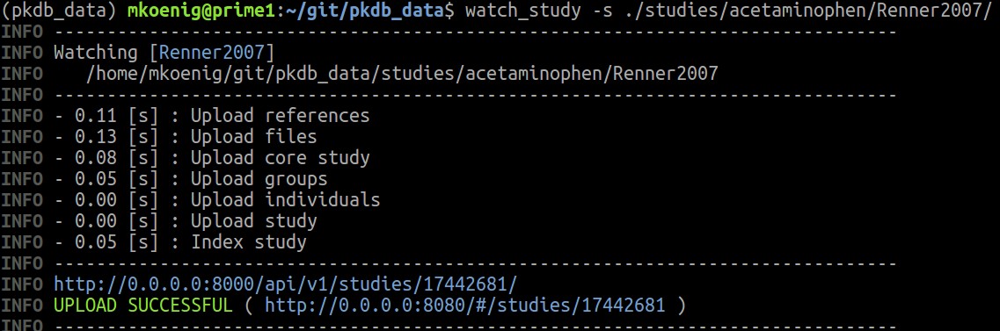
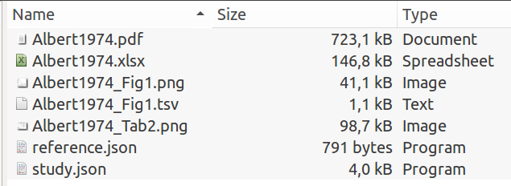

# Curation of pharmacokinetics studies for PK-DB

This document provides resources and information on how to curate data and information
from pharmacokinetics studies for the PK-DB database.

Available choices for important fields are available from the PK-DB frontend  
https://develop.pk-db.com/#/curation

If things are unclear during curation or you find incorrect or missing information in 
this document please open an issue at  
https://github.com/matthiaskoenig/pkdb/issues  
with the label `data curation`.


## Interactive curation

All information of a single study is stored in one folder. The complete information can be uploaded 
and iteratively curated using the provided `watch_study` script. The script uploads 
the latest data on file changes therefore allowing rapid iteration of curation and 
validation. Information on how to setup the `watch_study` script is provided
in https://github.com/matthiaskoenig/pkdb_data

As initial setup create a virtual environment with `pkdb_data` installed.
```
git clone https://github.com/matthiaskoenig/pkdb_data.git
cd pkdb_data
mkvirtualenv pkdb_data --python=python3.6
pip install -e .
```
Next step is to export your credentials via environment variables. 
Therefore, create a `.env` file by coping `env.template`.
```
cp .env.template .env
```
and update the the `USER` and `PASSWORD` in the `.env`. 
```
API_BASE=https://develop.pk-db.com
USER=PKDB_USERNAME
PASSWORD=PKDB_PASSWORD
```
And export the variables via
```
set -a && source .env
```
To check the environment variables use
```
echo $API_BASE
echo $USER
echo $PASSWORD
```

To watch a given study use 
```
# activate virtualenv with watch_study script
workon pkdb_data

# export environment variables for backend
(pkdb_data) set -a && source .env

# run the watch script
(pkdb_data) watch_study -s $STUDYFOLDER
```

Here the example output for the successfully uploaded study `Renner2007`. On file changes the study will be reuploaded


## 1. PDF, Reference, Figures & Tables

For upload a certain folder structure and organisation is expected of the `$STUDYFOLDER`.
The first step is to create the folder and the basic files in the folder 

- folder name is `STUDYNAME`, e.g., `Albert1974`
- folder contains the pdf as `STUDYNAME.pdf`, e.g., `Albert1974.pdf`
- folder contains additional files associated with study, i.e.,
    - tables, named `STUDYNAME_Tab[1-9]*.png`, e.g., `Albert1974_Tab2.png`
    - figures, named `STUDYNAME_Fig[1-9]*.png`, e.g., `Albert1974_Fig1.png`
    - excel file, named `STUDYNAME.xlsx`, e.g., `Albert1974.xlsx`

In addition the folder can contain data files, 
named `STUDYNAME_Tab[1-9]*.tsv` or `STUDYNAME_Fig[1-9]*.tsv`
    The information is the excel file is the primary data source, i.e., the `*.tsv`
information is redundant and not guaranteed to be maintained.

Information about the study is stored in the `study.json` which we will create 
in the following steps. Information about the reference for the study is stored
in the `reference.json` (this file is created automatically and should not be altered).



## 2. Initial study information (`study.json`)

For modifying JSON files best use the `Atom` editor with the plugin `pretty-json` and activate the following 
settings `Notify on Parse Error` and `Prettify on Save JSON`.

If a `study.json` is already existing we will modify it in the following, if not 
now is the time to create a new `study.json` in the `$STUDYFOLDER`. The following template JSON
contains all the relevant information  
 
```json
{
    "sid": 123456789,
    "pkdb_version": 1.0,
    "name": "Author2007",
    "reference": 123456789,
    "licence": "open || closed",
    "access": "public || private",
    "creator": "mkoenig",
    "curators": [
        ["mkoenig", 0.5]
    ],
    "collaborators": [],
    "descriptions": [],
    "comments": [],
    "groupset": {
        "descriptions": [],
        "comments": [],
        "groups": []
    },
    "individualset": {
        "descriptions": [],
        "comments": [],
        "individuals": []
    },
    "interventionset": {
      "descriptions": [],
      "comments": [],
      "interventions": []
    },
    "outputset": {
      "descriptions": [],
      "comments": [],
      "outputs": [],
      "timecourses": []
    }
}
```
* Fill in basic information for study, i.e., the `name` field with the `$STUDYNAME`, the `creator` and `curator` and `collaborator` fields with existing users 
(creator is a single user, whereas curators is a list of users), 
the `sid` and `reference` field with the `PubmedId` of the study.  
* The `reference` field is optional. If no pubmed entry exist for publication a `reference.json` should be build manually (please ask what to do in such a case).
* The `access` field provides information on who can see the study. `public` provides access to everyone, `private` only to the `creator`, `curators` and `collaborators`.
* The `curators` is a list which consists of either curator names (e.g. `mkoenig`) or a curator name with a curation score between 0.0 and 5.0 (e.g. `[mkoenig, 3.5]`)
* The `licence` field provides information on the licence of the publication. This is either `open` in case of Open Access publications or `closed` otherwise. Images and the PDF are only shown publicly if the publication is Open Access.

After this initial information is created in the `study_json` we can start running the `watch_study` script.
```
(pkdb_data) watch_study -s $STUDYFOLDER
```

### Comments and descriptions
The study and all sets allow to store additional annotions either in the form of `descriptions` or `comments`. 
Descriptions are quotations from the publication to substantiate and support the curated data.
`comments` provide the possibility to store information from individual curators. Examples of comments are stating incorrect units, missing data or strange conversions of data. 


## 3. Curation of groups and individuals
### groups
The next step is the curation of the `group` information, i.e., which groups where studied. The information is stored in the `groupset` of the following form.
Retrieve group information from the publication and copy it in the description of the groupset. The top group containing all subjects must be called `all`.

The main steps for defining groups is to set the `name` and `count` of the group (with `name` being `all` for the top-level group, or an arbitrary descriptive name
otherwise; the `count` is the number of subjects in the group. In addition to this core information a group is characterized by `characteristica`.
An overview over the available `characteristica` and possible choices is available from https://develop.pk-db.com/#/curation
```json
{
  "groupset": {
    "descriptions": [
      "The subjects were six healthy volunteers, three males and three females, aged 21.0 ± 0.9 years (range 20 to 22 years) and weighing 63 ± 11 kg (range 50 to 76 kg). All were nonsmokers. Subjects abstained from all methylxanthine containing foods and beverages during the entire period of the study. Compliance with this requirement was assessed by questioning at each presentation for blood sampling or urine delivery."
    ],
    "comments": [],
    "groups": [
      {
        "count": 20,
        "name": "all",
        "characteristica": [
          {
            "measurement_type": "species",
            "choice": "homo sapiens"
          },
          {
            "measurement_type": "healthy",
            "choice": "Y"
          },
          {
            "measurement_type": "overnight fast",
            "choice": "Y"
          },
          {
            "measurement_type": "fasted",
            "min": "10",
            "max": "14",
            "unit": "hr"
          }
        ]
      }
    ]
  }
}
```
* The groups are defined via `characteristica`, shared characteristica of groups can be defined via parent groups.
* The possible values of categorial are accessible via `pkdb_app/categorials.py`.
* The group names have to be unique within the groupset and should be descriptive, e.g., smoker, nonsmoker, contraceptive.
* All groups require a `name`, all groups with exception of `all` require `parent` field.
    "parent": "string",

All available fields for characteristica on group are:
```json
{
    "measurement_type": "categorial",
    "choice": "categorial|string",
    "count": "int",
    "mean": "double",
    "median": "double",
    "min": "double",
    "max": "double",
    "sd": "double",
    "se": "double",
    "cv": "double",
    "unit": "categorial"
}
```
### individuals
Individuals are curated very similar to groups with the exception that individuals must belong
to a given group, i.e., the `group` attribute must be set. Individuals are most often defined based on spreadsheet mappings.
See for instance below individuals which are defined via a table. 

```json
"individuals": [
      {
        "name": "col==subject",
        "group": "col==group",
        "source": "Akinyinka2000_Tab1.csv",
        "format": "TSV",
        "figure": "Akinyinka2000_Tab1.png",
        "characteristica": [
          {
            "measurement_type": "age",
            "value": "col==age",
            "unit": "yr"
          },
          {
            "measurement_type": "weight",
            "value": "col==weight",
            "unit": "kg"
          },
          {
            "measurement_type": "sex",
            "choice": "col==sex"
          }
        ]
      }
    ]
```
Even if individuals have no information on the characteristica, a table with individual names have to be created for later reference.

## 4. Curation of interventions/interventionset
```json
{
    "interventionset": {
        "description": "All patients and volunteers fasted overnight and, at 0800 hours, were given orally 300 mg caffeine dissolved in 150 ml water; food intake was allowed 3 h after administration of caffeine.",
        "interventions": [
          {
            "name": "glciv",
            "substance": "glucose",
            "route": "iv",
            "form": "solution",
            "application": "single dose",
            "measurement_type": "dosing",
            "value": "0.5",
            "unit": "g/kg",
            "time": "0",
            "time_unit": "hr"
          }
        ]
    }
}
```
All available fields for intervention and interventionset are:
```json
{
 
    "name": "string",
    "measurement_type": "categorial",
    
    "substance": "categorial (substance)",
    "route": "categorial {oral, iv}",
    "application": "categorial {'single dose', 'multiple dose', 'continuous injection'}",
    "form": "categorial {'tablete', 'capsule', ...}",
    "time": "double||double||double ...",
    "time_unit": "categorial",
     
    "choice": "categorial|string",
    "value": "double",
    "mean": "double",
    "median": "double",
    "min": "double",
    "max": "double",
    "sd": "double",
    "se": "double",
    "cv": "double",
    "unit": "categorial"
}
```
* TODO: document after next iteration

## 5. Curation of outputs and time courses
The actual data in publication is available either from tables, figures or stated with the text.
All information should be curated by the means of excel spreadsheets, i.e., data must be digitized and transferred from the
PDF in a spreadsheet.

- Use Excel (LibreOffice/OpenOffice) spreadsheets to store digitized data
- change language settings to use US numbers and formats, i.e. ‘.’ separator). Always use points (‘.’) as number separator, never comma (‘,’), i.e. 1.234 instead of 1,234.

For all figures and tables from which data is extracted individual images (`png`) must be stored in the study folder, i.e.,
- tables, named `STUDYNAME_Tab[1-9]*.png`, e.g., `Albert1974_Tab2.png`
- figures, named `STUDYNAME_Fig[1-9]*.png`, e.g., `Albert1974_Fig1.png`
Use the screenshot functionality in the PDF viewer and save with image program like `gimp` after removing unnecessary borders of images.


### Figures
- Use PlotDigitizer to digitize figures (https://sourceforge.net/projects/plotdigitizer/)
    - download programm 
    - run plotdigitizer with java
- Open the image to digitize (`STUDYNAME_Fig[1-9]*.png`)
- Use the Zoom function to increase the image if necessary (easier to click on data points)
- First axes have to be calibrated (make sure to set logarithmical axes where necessary); calibration should be done very carfully because it will have a systematic effect (bias) on all digitized data points.
- Digitize one curve at a time
- Digitize mean and error separately (the actual error can than be calculated in excel as `abs(mean-error)`)
- In case of time courses adapt the time points to the actual times reported in the publication

")

Some tips for digitizion of figures:
- Check that axes are do not have any breaks or different scales (sometimes an axis is continued or not scaled equally). This will create problems in the digitization.
- use the same axes calibration for all curves in a figure, i.e., always finish all data from a single figure panel completely in one go (otherwise different bias for the different curves)
- The left lower corner is not always `(0,0)`, use the minimal x-tick an y-tick with available numerical values
- set the number of digits to a reasonable value (2-3 digits)

### Tables

```json
{
        "source": "Akinyinka2000_Tab3.csv",
        "format": "TSV",
        "subset": "substance==paraxanthine",
        "figure": "Akinyinka2000_Tab3.png",
        "group": "healthy subjects",
        "interventions": [
            "Dcaf"
        ],
        "substance": "paraxanthine",
        "tissue": "col==tissue",
        "measurement_type": "cmax || tmax || auc_inf || thalf",
        "mean": "col==cmax || col==tmax || col==aucinf || col==thalf",
        "sd": "col==cmax_sd || col==tmax_sd || col==aucinf_sd || col==thalf_sd",
        "unit": "\u00b5g/ml || hr || \u00b5g*hr/ml || hr"
    }
```

```json
{
    "timecourses": [
      {
        "group": "all",
        "groupby": "intervention",
        "interventions": "col==intervention",
        "source": "Albert1974_Fig1.tsv",
        "format": "TSV",
        "figure": "Albert1974_Fig1.png",
        "substance": "paracetamol",
        "tissue": "plasma",
        "measurement_type": "concentration",
        "time": "col==time_min",
        "time_unit": "min",
        "mean": "col==apap",
        "cv": "col==apap_cv",
        "unit": "µg/ml"
      }
    ]
}
```


## Units for curation
Units are crucial information to make sense out of the data set. So many `characteristica`, `interventions` and `outputs/timecourses`
require to provide unit information. 
We are using a pints unit model. If units are missing or incorrect the `watch_study` script will report the
respective issues.


# Frequently asked questions (FAQ)
## How to encode multiple substances which are given (e.g., caffeine and acetaminophen are given)?
- encode as individual interventions of caffeine and acetaminophen, i.e., single interventions 
with the respective doses. In the outputs a list of intervention is provided, i.e., in this example the interventions for caffeine and acetaminophen


