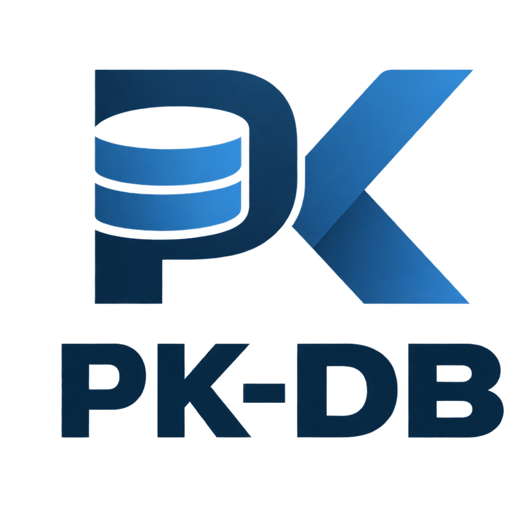
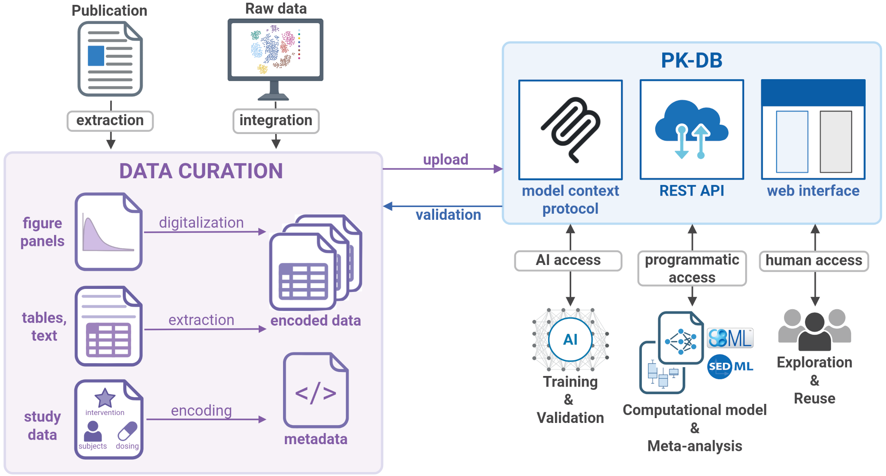

[](https://github.com/matthiaskoenig/pkdb/actions/workflows/ci-cd.yml) [](https://github.com/matthiaskoenig/pkdb/actions/workflows/ruff.yml) [](https://github.com/matthiaskoenig/pkdb/actions/workflows/ty.yml) [](https://github.com/matthiaskoenig/pkdb/actions/workflows/docs.yml) [](https://doi.org/10.5281/zenodo.1406979) [](https://opensource.org/licenses/MIT)

# PK-DB – The Pharmacokinetics Database

[PK-DB](https://pk-db.com) is an open database and web platform for the **curation, integration, validation, and analysis of pharmacokinetic (PK) data** from clinical studies and preclinical research.

> [!IMPORTANT]
> **PK-DB update in progress**
>
> PK-DB and its API are currently being updated. A new release with an improved data model, validation, documentation, and API will be available shortly.

PK-DB connects pharmacokinetic measurements with their complete experimental and study context. It supports the structured representation of:

- **Study populations and individuals**, including characteristics such as age, sex, body weight, health status, and smoking status
- **Interventions**, including administered substances, doses, dosing schedules, and routes of administration
- **Pharmacokinetic measurements**, including concentration–time courses and derived PK parameters such as clearance, half-life, area under the curve (AUC), and maximum concentration (Cmax)
- **Study and experimental metadata**, linking measurements to the conditions under which they were obtained

Key features of PK-DB include:

- Representation of **measurement uncertainty, variability, and experimental error**
- **Normalization and harmonization of units** for consistent comparison and analysis
- Semantic annotation using **biological and biomedical ontologies**
- Automated calculation of pharmacokinetic parameters from concentration–time courses
- Workflows for **collaborative and reproducible data curation**
- Extensive **data validation and quality-control rules**
- Programmatic access through a **REST API** for integration into analysis, modeling, and automated workflows

By combining pharmacokinetic data with structured metadata, semantic annotations, validation, and programmatic access, PK-DB provides a foundation for **reproducible pharmacokinetic analyses, meta-analyses, PBPK modeling, and the development of pharmacological digital twins**.




PK-DB is available from [https://pk-db.com](https://pk-db.com). The terms of use are listed in the [`TERMS_OF_USE.md`](./TERMS_OF_USE.md).


## Python client and command line

Install the public package from this checkout with `uv tool install ./python` (Python 3.14 or 3.15). Existing `pkdb_data` study folders work directly:

```bash
pkdb prepare /path/to/pkdb_data/studies/ExampleStudy
pkdb validate /path/to/pkdb_data/studies/ExampleStudy --offline
pkdb upload /path/to/pkdb_data/studies/ExampleStudy --endpoint https://pk-db.com
```

Preparation and validation run locally. Upload validates first and uses `PKDB_API_KEY` for authentication. See the [Python client guide](docs/python-client.md) for vocabulary snapshots, Python examples, and reproducible validation.

## Local setup

From the repository root, start the frontend, backend, and database, then create your administrator (replace `USERNAME` and `ADMIN_EMAIL`):

```bash
docker compose --profile dev up --build --wait
docker compose exec backend pkdb-server create-admin USERNAME --email ADMIN_EMAIL
```

Open <http://localhost:8080> and sign in with the password entered at the prompt. See [Local setup and development](docs/installation.md) to import our users and avatars, load studies, and run tests.

## Documentation

The full documentation, including installation, deployment and development, is at [https://matthiaskoenig.github.io/pkdb](https://matthiaskoenig.github.io/pkdb).

## How to cite
If you use PK-DB data or the web interface cite

> Grzegorzewski J, Brandhorst J, Green K, Eleftheriadou D, Duport Y, Barthorscht F, Köller A, Ke DYJ, De Angelis S, König M. *PK-DB: pharmacokinetics database for individualized and stratified computational modeling*. Nucleic Acids Res. 2021 Jan 8;49(D1):D1358-D1364. doi: [10.1093/nar/gkaa990](https://doi.org/10.1093/nar/gkaa990). PMID: [33151297](https://pubmed.ncbi.nlm.nih.gov/33151297/).

If you use PK-DB code cite in addition 

[](https://doi.org/10.5281/zenodo.1406979)

## License
PK-DB code and documentation is licensed as
- Source Code: [MIT](https://opensource.org/license/MIT)
- Documentation: [CC BY-SA 4.0](https://creativecommons.org/licenses/by-sa/4.0/)

## Funding
Matthias König (MK) and Jan Grzegorzewski were supported by the Federal Ministry of Education and Research (BMBF, Germany) within the research network Systems Medicine of the Liver (LiSyM, grant number 031L0054). MK is supported by the Federal Ministry of Education and Research (BMBF, Germany) within ATLAS by grant number 031L0304B and by the German Research Foundation (DFG) within the Research Unit Program FOR 5151 QuaLiPerF (Quantifying Liver Perfusion-Function Relationship in Complex Resection - A Systems Medicine Approach) by grant number 436883643 and by grant number 465194077 (Priority Programme SPP 2311, Subproject SimLivA).

&copy; 2017-2026 Matthias König; https://livermetabolism.com.
