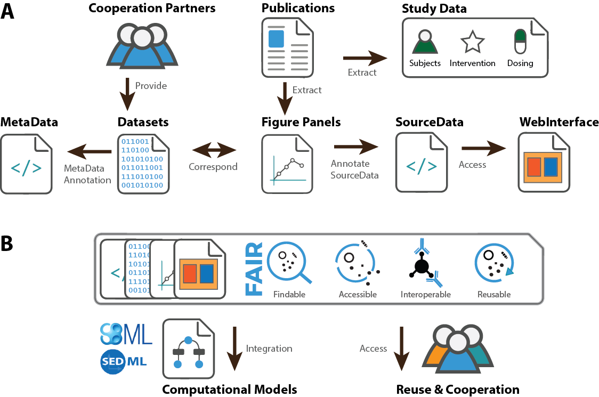

[](https://doi.org/10.5281/zenodo.1406979)
[](https://travis-ci.org/matthiaskoenig/pkdb)

# PKDB - Pharmacokinetics database

<b><a href="https://orcid.org/0000-0002-4588-4925" title="0000-0002-4588-4925"></a> Jan Grzegorzewski</b>
and
<b><a href="https://orcid.org/0000-0003-1725-179X" title="https://orcid.org/0000-0003-1725-179X"></a> Matthias König</b>

Database and web interface for storing (pharmaco-)kinetics information including
- study data (publication data)
- trial design
- subjects information
- interventions
- dosing schemas
- pharmacokinetics parameters 
- timecourse data


Figure 1: Overview over data extraction and curation work flow.

https://docs.google.com/document/d/1UvfgZCYk0Gs9sJV7fZe80Na8RY2C8MgYqsExkDyYp1U/edit# Installation
The database with backend and frontend is available as docker container for local installation.

## Requirements
- [Docker](https://docs.docker.com/install/linux/docker-ce/ubuntu/)
- Python3.6

## Setup development server
For elasticsearch to work the following system settings are required
```
sudo sysctl -w vm.max_map_count=262144
```
To set `vm.max_map_count` persistently change the value in 
```
/etc/sysctl.conf
```

To setup the development server for local development (backend & frontend):
```bash
# clone or pull the latest code
git clone https://github.com/matthiaskoenig/pkdb.git
cd pkdb
git pull

# set environment variables
set -a && source .env.local
 
# create/rebuild all docker containers
./docker-purge.sh
```
This setups a clean database and clean volumes.

## Update development server
To update an existing version use
```bash
cd pkdb
git pull
set -a && source .env.local
./docker-update.sh
```

The database index can be rebuild via
```bash
./elastic-rebuild-index.sh
```

## Interact with containers
To check the running containers use
```
watch docker container ls
```

To get an interactive container mode use
```
./docker-interactive.sh
```

To get access to individual container logs use `docker container logs`, e.g., to see the
django backend logs use
```
docker container logs pkdb_backend_1 
```

To run commands inside the docker container use
```bash
docker-compose run --rm backend [command]
```
or to run migrations
```bash
docker-compose run --rm backend python manage.py makemigrations
```

## REST services
PKDB provides a REST API which allows simple interaction with the database.
An overview over the REST endpoints is available from
```
http://localhost:8123/api/v1/
```
The REST API supports elastisearch queries, with examples 
available from https://django-elasticsearch-dsl-drf.readthedocs.io/en/0.16.2/basic_usage_examples.html

Query examples:
```
http://localhost:8000/api/v1/comments_elastic/?user_lastname=K%C3%B6nig
http://localhost:8000/api/v1/characteristica_elastic/?group_pk=5&final=true
http://localhost:8000/api/v1/characteristica_elastic/?search=group_name:female&final=true
http://localhost:8000/api/v1/substances_elastic/?search:name=cod
http://localhost:8000/api/v1/substances_elastic/?search=cod 
http://localhost:8000/api/v1/substances_elastic/?ids=1__2__3 
http://localhost:8000/api/v1/substances_elastic/?ids=1__2__3&ordering=-name
http://localhost:8000/api/v1/substances_elastic/?name=caffeine&name=acetaminophen
```

Suggestion example:
```
http://localhost:8000/api/v1/substances_elastic/suggest/?search:name=cod
```

## Fill database
Database is filled using `pkdb_data` repository at https://github.com/matthiaskoenig/pkdb_data
 
## Read 
&copy; 2017-2019 Jan Grzegorzewski & Matthias König.
