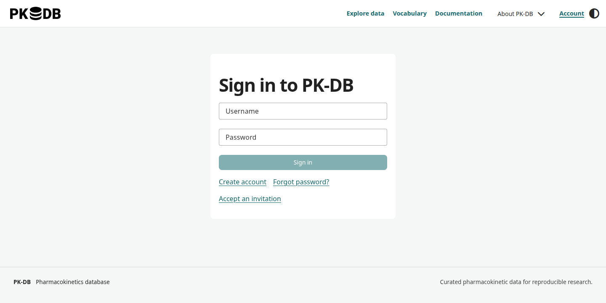

# Accounts and API keys

Browse public data at [alpha.pk-db.com](https://alpha.pk-db.com) without signing in. Sign in to download datasets or attachments, access studies shared with you, or curate data when your account has permission.

## Sign in or create an account

1. Open **Account** and enter your username and password.
2. If you are new, choose **Create account**, enter your details, and follow the email verification instructions.
3. If you have an invitation, use the invitation page and token you received to choose a password.

*The current frontend sign-in page. Screenshots in this guide use an isolated demonstration instance.*

Use **Forgot password?** on the sign-in page if you cannot sign in. Request recovery using your verified email address, then follow the instructions in the email. Recovery signs out existing sessions and revokes API keys; update scripts with a new key afterwards.

## Manage your profile

In **Account settings**, edit your display name, affiliation, title, and photo. GitHub and ORCID are optional profile references; you still sign in with your PK-DB username and password. You can choose whether these references are public. Email addresses are private; verify a primary address before creating an API key.

Use **Assigned studies** to find studies associated with your account and **Security history** to review recent account activity. Use **Sessions** to sign out a browser you no longer use.

## Create an API key

1. Sign in at [alpha.pk-db.com/account](https://alpha.pk-db.com/account).
2. Open **API keys**, enter a descriptive key name, and choose an expiry.
3. For reading and downloads, use the default `read` scope. If your account can curate studies, enable study uploads and edits to add `studies:write`.
4. Choose **Create key** and confirm your password if asked.
5. Save the key when it is displayed; the secret is shown only once.

Set `PKDB_API_KEY` in the environment where you run your script or CLI. Keep it out of notebooks, shared files, command output, and source control. The [Python client](python-client.md) reads this variable automatically. Direct REST requests use `Authorization: Bearer YOUR_API_KEY` over HTTPS.

Keys expire and can be **rotated** or **revoked** from the same tab. Rotation gives you a short overlap to update scripts; revocation takes effect on subsequent requests. A key cannot create other keys or manage your account.

## Study access and curation

Public studies are visible to everyone. Private studies are visible only to their assigned curators and the administrator. In account settings, request curator access if you need to upload data. Curators can upload new studies with either visibility and edit their assigned studies. Reviewers can edit public studies, but need a curator assignment to access a private study. An API key never grants more access than its owner, even when it has `studies:write`.

The contributor names recorded in a study describe attribution; they do not grant private-data access or editing permission. If a study you need is unavailable, ask its curator or the PK-DB team for access.

Downloads require an active account even for public studies. A download includes only data and attachments your account can access. Check the study licence before reusing or redistributing data.

## Requests that are refused

- **401:** sign in again, or check whether your API key is missing, expired, or revoked.
- **403:** check your role, key scope, and access to the requested study.
- **429:** wait for the `Retry-After` interval before making another request.

For request examples and pagination, see the [REST API guide](api.md).
