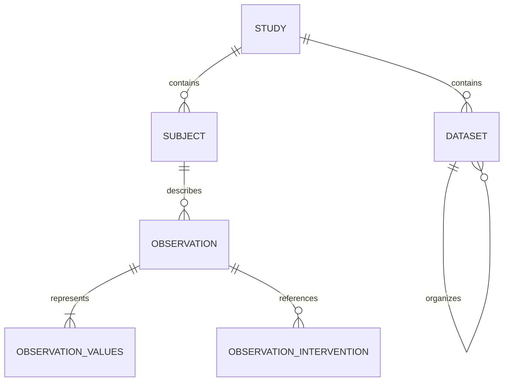

# Internal scientific data model

PK-DB stores groups and individuals as subjects, and characteristics and outputs as observations. The curation files and API response shapes remain compatible; group/individual and characteristic/output names at those interfaces are adapters over the shared storage.

## Subjects and observations

A subject has a study, name, kind, count, and optional parent. An individual has count one, but a group containing one participant remains a group. Individual identity and group hierarchy are retained. Every observation has one subject reference.

`observations` stores scientific identity and context, including the measurement type, substance, subject, method, tissue, time, source, and whether the result was calculated. `observation_values` stores its numerical representations and units. Reported and normalized values share context when the metadata agrees; their original values, keys, and derivation links remain distinct. Intervention associations are stored once on the shared observation context.

A measured individual value is still a `value`, not silently relabeled a population `mean`. Mean, median, uncertainty, and missing versus zero retain their scientific meanings. Characteristics and outputs use the same subject count defaults and group statistical completion. An explicit measurement count is retained; otherwise group count or one for an individual supplies the default. Processing version 6 identifies this harmonized behavior.



## Datasets without point entities

The `datasets` table stores dataset containers and ordered series/course records. Each series stores an ordered array of observation representation IDs. Scatter rows are flattened in row-major order; dimension metadata defines the width, and a parallel array preserves row identifiers used by existing exports. Optional row source metadata is stored in an ordered JSON array. There are no `timecourse_points`, `subset_points`, or `subset_dimensions` tables.

Numerical observations remain available for scientific calculation and existing output APIs. Normal dataset responses load their referenced observations once and expand arrays in memory. Existing flat analysis/export APIs use a SQL projection of array positions when filtering or pagination requires it; that projection is not a persisted point entity. Multiple datasets can reference the same observation.

Database constraints validate array shape, complete scatter rows, same-study references, duplicate course membership, and valid parent/derivation kinds. Deferred validation allows atomic study replacement. Dataset membership writes and deletion of referenced values require the service's default `READ COMMITTED` isolation; incompatible write isolation is rejected explicitly. Read-only repeatable-read snapshots remain supported. The app never infers pairing from matching values or combines separate curves solely because their labels match.

## Fresh database setup

The migration history starts at the consolidated `p001initial` baseline. The subsequent `p002retirelegacy` migration removes obsolete upload drafts and ineffective reader grants while preserving published data. This baseline requires an empty database; upgrading a database stamped with an older revision is no longer supported. Do not stamp an existing schema with the new revision.

Follow the [local upload guide](local-upload-testing.md) to start the server, create an administrator, import users, and upload the original study folders again. Docker Compose applies the initial migration automatically. For a native installation, set `PKDB_DATABASE_URL` to the empty database and run:

```bash
cd backend
uv run --locked alembic upgrade head
uv run --locked alembic check
```

Use a processing-version-6 client. Re-uploaded studies receive new numeric identifiers; old numeric resource references and saved selections must be recreated. Study SIDs and source keys remain stable. The baseline includes search indexes, scientific integrity triggers, and initial security configuration. No historical ID conversion or point-table migration runs during setup.

## Verification and performance

Regression checks cover canonical study round-trips, atomic replacement/rollback, group inheritance, API searches, analysis pagination, scatter pairing, source provenance, fresh schema creation and downgrade/recreation, and malformed/cross-study array references. Corpus benchmarking uses isolated schemas and hashes source files before and after uploads.

Measured corpus results are recorded in the [implementation plan](superpowers/plans/2026-09-24-unified-observation-model.md). Timings are local observations, not a guarantee of production latency; the shared context/value join trades additional joins for less duplicated metadata and fewer association rows.
