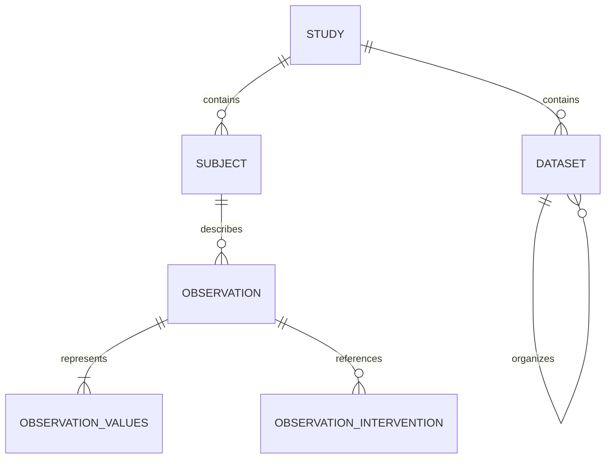

# Internal scientific data model

PK-DB stores groups and individuals as subjects, and characteristics and outputs as observations. The curation files and API response shapes remain compatible; group/individual and characteristic/output names at those interfaces are adapters over the shared storage.

## Publications, studies, and acquisition sources

A study is uniquely identified by `(publication_id, source_key)`. Publication identity is shared through normalized PMID/DOI aliases. Each study keeps its own citation snapshot, scientific graph, access controls, and attachments. Manual curation and an OSP import of the same paper therefore coexist; refreshing the import does not modify the manual study.

Study metadata has discriminated acquisition records: `ManualCuration` (`manual_curation`), `DataImport` (`data_import`), and `AutomaticCuration` (`automatic_curation`). Existing studies default to `pkdb.manual`. Import provenance records the stable provider key, release, revision, importer version, source URLs/checksums, and upstream dataset IDs. Acquisition is independent of the numerical representation (`reported`, `normalized`, `calculated`). New releases replace the same source study; a different study identifier for an existing publication/source pair is rejected.

Identifiers may be enriched with additional aliases, but contradictory aliases or publication/source changes require explicit reconciliation. Without a PMID or DOI, a source URL or explicit reference `sid` provides provisional identity; titles alone are not used to infer matches across sources. Migration `p004sources` backfills existing manual studies and stops on duplicate publication identities rather than silently merging them.

See [OSP import](osp-import.md) and [public dataset imports](public-dataset-imports.md) for conversion, validation, provenance, and known source limitations. `DataImport` additionally records `evidence_kind`, `reference_scope`, and `source_terms`; missing classifications default to `unknown`. The attached report links native records to original artifact rows and mapping operations.

## Study identity, release and review

The study identifier of a study in study format 2 is `<substance>/<name>`, the location of its folder (for example `caffeine/Harder1988`), and its `name` is the folder name. A study in study format 1 keeps its single-segment identifier (for example `PKDB01110`) until its folder is migrated. The `sid` column holds both. Released studies additionally store a unique PKDB identifier in `pkdb_id` (`PKDB` and five digits) and the `release_date`, which is also the study `date`; the two are set together. A released study keeps its PKDB identifier when it is renamed or corrected. `legacy_sid` (unique) keeps the former single-segment identifier of a study format 1 study that a study format 2 upload took over.

Studies also store the number of their curation `issue`, the `review_status` (`draft`, `in_review` or `approved`) and the `review` document with the reviewers and review items of `review.json`. The study text search includes the PKDB identifier. An upload of a released study whose study identifier is not stored yet takes over the study that has its PKDB identifier (a study format 1 study has it as its own study identifier) and renames it, so no data reset is needed. Otherwise a study format 2 upload whose study identifier is not stored yet takes over the only stored study of the same publication and source when that study has a single-segment identifier (study format 1), for example `Vilsboll2008` for `liraglutide/Vilsboll2008` or `24639432` for `lixisenatide/YuPan2014`. The taken over study keeps its row, permissions, curators, collaborators and creation data, its identifier becomes `<substance>/<name>`, and `legacy_sid` keeps its former identifier; a takeover by PKDB identifier records the former identifier too when it is not the PKDB identifier. A takeover needs edit rights on the study: without them the upload is refused with a conflict (409) that names the study only to its readers. A study of the same publication and source with a two-segment identifier is never taken over (409), and an upload whose PKDB identifier and publication identify different studies is refused (409). The API serves such a study under `/api/v2/studies/{substance}/{name}` and redirects its PKDB identifier and its former identifier there, see [study identifiers](api.md#study-identifiers-and-redirects); a study format 1 upload under a former identifier is refused (409).

## Subjects and observations

A subject has a study, name, kind, count, and optional parent. An individual has count one, but a group containing one participant remains a group. A group with an unreported sample size has a null count. Individual identity and group hierarchy are retained. Every observation has one subject reference.

`observations` stores scientific identity and context, including the measurement type, substance, subject, method, tissue, time, source, and whether the result was calculated. Characteristics, outputs and interventions share this context: study format 2 gives all three tissue, method, time, time unit, the flags for a time or unit that the publication does not report, and the image of the paper table or figure. Interventions keep the same fields in their own table. `observation_values` stores its numerical representations and units. Reported and normalized values share context when the metadata agrees; their original values, keys, and derivation links remain distinct. Intervention associations are stored once on the shared observation context.

Processing version 9 has no `value` statistic. The value of one subject and the central value of an `unspecified summary` are stored in `mean`: an individual's `mean` is that subject's value and cannot be combined with population statistics or a calculation type, and a group's `mean` is its arithmetic mean unless the calculation type is the built-in vocabulary term `unspecified summary`. The latter marks a central value whose statistic the publication does not state; it cannot claim any other statistic, is not completed, and does not produce derived PK parameters. Mean, median, uncertainty, and missing versus zero retain their scientific meanings.

Observations and interventions carry the same statistics: arithmetic and geometric summaries, the subject `count` and a digitized error bar, listed under [statistics in responses](api.md#statistics-in-responses). `cv` and `gcv` are fractions in the model and the API, whereas study format 2 tables enter them in percent and the reader divides them by 100. An intervention reports its dose in `mean`.

Characteristics and outputs use the same subject count defaults and group statistical completion. An explicit measurement count is retained; otherwise group count or one for an individual supplies the default, in the reported and the normalized representation alike, and unknown group counts remain null. A pharmacokinetic parameter derived from a timecourse takes the count of the timecourse, the smallest count of its points (null when the count of a point is unknown), and interventions have a count only when they state one. Completion never overwrites a reported value and happens in the normalized representation of group records with a sample mean (or no calculation type): `sd`, `se` and `cv` are derived from each other with `count` and the magnitude of `mean`, `gsd` and `gcv` from each other, and `sd`, `se` or `gsd` from `error_bar` (the distance of the bar from `mean`, or the factor between `error_bar` and `gmean`). Arithmetic and geometric statistics are never derived from each other. Unit conversion scales every value stated in the unit (`mean`, `median`, `min`, `max`, `sd`, `se`, `gmean` and `error_bar`) and leaves `cv`, `gsd`, `gcv` and `count` unchanged. Reported statistics that contradict each other produce the warning `inconsistent_statistics`. Each reported `sd`, `se` (with `count`), `cv` (times the magnitude of a nonzero `mean`) and `error_bar` of type `sd` or `se` implies a standard deviation, and each `gsd`, `gcv` and `error_bar` of type `gsd` implies the standard deviation of the logarithms, sigma_log = ln(`gsd`) (from `gcv` as the square root of ln(1 + `gcv`²), from an error bar as the logarithm of the factor between `error_bar` and `gmean`), because near a `gsd` of 1 a relative tolerance on `gsd` itself would hide large differences; the check runs on the reported values before unit conversion and never compares the two families. Two implied values of a family disagree when they differ by more than 2 percent of the larger one and by more than their rounding uncertainty: half a unit of the last decimal place of each reported value, taken from its shortest decimal representation and propagated through the conversion. For example, `se` 0.3 with `count` 9 implies `sd` 0.9 ± 0.15, so a reported `sd` of 0.95 does not warn and 1.06 does; `gsd` 1.104 and `gcv` 11.55 % (which implies `gsd` 1.122) differ by 14 percent in sigma_log and warn, whereas `gsd` 1.1 (1.05 to 1.15) and `gcv` 11.5 % do not. The message names only the disagreeing pairs with their reported values, for example `se 0.1 implies sd 0.2, but error_bar 12 (sd) implies sd 2`, and the issue context holds the `reported` values, the `implied_sd` of each arithmetic field, the `implied_sigma_log` of each geometric field and the `disagreeing` pairs; the message states geometric spreads as the `gsd` they imply. The warning is placed at the field that disagrees with the most others (on a tie `error_bar`, otherwise the first of `sd`, `se`, `cv`, `gsd` and `gcv`), and a review item acknowledges it at that column. The API orders measurement and intervention rows on request by this central value (`central_value`): the mean, else the median, else the geometric mean.

Intervention times are structured. `time` is a number, or a list of at least two administration times for an irregular schedule; a regular schedule uses `interval` (the dosing interval) and `doses` (the number of administrations) with `time` the first administration. `time_end` is the end of a continuous administration, and an optional `subject` names the group or individual that the dose statistics describe. Schedule strings are no longer stored. The study format 1 importer parses `0|12|40` into the time list `[0, 12, 40]` and `S0T24R7` (start, interval and number of administrations, `R` counting administrations) into `time` 0, `interval` 24 and `doses` 7; a `|` list that mixes both expands to explicit times, and any other text is the error `invalid_schedule`. Migration `p006studyformat` converts stored schedule text with the same grammar.


```mermaid
erDiagram
    STUDY ||--o{ SUBJECT : contains
    SUBJECT ||--o{ OBSERVATION : describes
    OBSERVATION ||--|{ OBSERVATION_VALUES : represents
    OBSERVATION ||--o{ OBSERVATION_INTERVENTION : references
    STUDY ||--o{ DATASET : contains
    DATASET ||--o{ DATASET : organizes
```

## Datasets without point entities

The `datasets` table stores dataset containers and ordered series/course records. Each series stores an ordered array of observation representation IDs. Scatter rows are flattened in row-major order; dimension metadata defines the width, and a parallel array preserves row identifiers used by existing exports. Optional row source metadata is stored in an ordered JSON array. There are no `timecourse_points`, `subset_points`, or `subset_dimensions` tables.

Numerical observations remain available for scientific calculation and existing output APIs. Normal dataset responses load their referenced observations once and expand arrays in memory. Existing flat analysis/export APIs use a SQL projection of array positions when filtering or pagination requires it; that projection is not a persisted point entity. Multiple datasets can reference the same observation.

Database constraints validate array shape, complete scatter rows, same-study references, duplicate course membership, and valid parent/derivation kinds. Deferred validation allows atomic study replacement. Dataset membership writes and deletion of referenced values require the service's default `READ COMMITTED` isolation; incompatible write isolation is rejected explicitly. Read-only repeatable-read snapshots remain supported. The app never infers pairing from matching values or combines separate curves solely because their labels match.

## Fresh database setup

The migration history starts at the consolidated `p001initial` baseline. The subsequent `p002retirelegacy` migration removes obsolete upload drafts and ineffective reader grants while preserving published data. This baseline requires an empty database; upgrading a database stamped with an older revision is no longer supported. Do not stamp an existing schema with the new revision.

Follow the [local upload guide](local-upload-testing.md) to start the server, create an administrator, import users, and upload the original study folders again. Docker Compose applies the initial migration automatically. For a native installation, set `PKDB_DATABASE_URL` to the empty database and run:

```bash
cd backend
uv run --locked alembic upgrade head
uv run --locked alembic check
```

Use a processing-version-9 client. Re-uploaded studies receive new numeric identifiers; old numeric resource references and saved selections must be recreated. Study format 1 identifiers and source keys remain stable. The baseline includes search indexes, scientific integrity triggers, and initial security configuration. No historical ID conversion or point-table migration runs during setup.

## Upgrade to study format 2

Migration `p006studyformat` upgrades a database at `p005vocabsearch`. It adds the statistics `gmean`, `gsd`, `gcv`, `error_bar` and `error_type` to observation values and interventions, the schedule fields `interval`, `doses`, `time_list` and `subject` and the observation context (tissue, method and the not-reported flags) to interventions, and the `pkdb_id`, `release_date`, `issue`, `review_status`, `review` and `legacy_sid` columns to studies, and it extends the study text search to the PKDB identifier. It moves every stored `value` into an empty `mean` (a different `mean` that already exists is kept and the conflict is logged), converts the schedule text of interventions with the grammar of the study format 1 importer, and drops `value` and the schedule text. It stops and lists the intervention ids of schedules it cannot convert instead of dropping them. The downgrade restores `value` and the schedule text where they are derivable.

Processing version 9 changes how studies are prepared (statistics in `mean`, structured schedules, derived geometric and error-bar statistics, the study identifier). Servers with processing version 9 refuse `pkdb` clients of other versions, so install the matching `pkdb` release, and upload every study again after the migration so that all stored studies follow the same rules. Uploads are idempotent and replace each study in place; a study format 2 upload takes over the stored study format 1 study by its PKDB identifier or by its publication and source and renames it to `<substance>/<name>`, as described above.

## Verification and performance

Regression checks cover canonical study round-trips, atomic replacement/rollback, group inheritance, API searches, analysis pagination, scatter pairing, source provenance, fresh schema creation and downgrade/recreation, and malformed/cross-study array references. Corpus benchmarking uses isolated schemas and hashes source files before and after uploads.

Measured corpus results are recorded in the [implementation plan](superpowers/plans/2026-09-24-unified-observation-model.md). Timings are local observations, not a guarantee of production latency; the shared context/value join trades additional joins for less duplicated metadata and fewer association rows.
