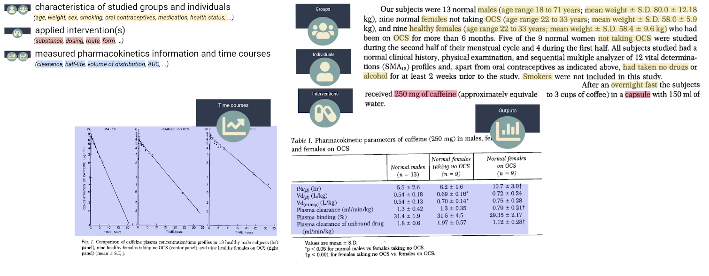

# Example study

See how a publication connects to structured subjects, interventions, and measurements in PK-DB.

R. V. Patwardhan, P. V. Desmond, R. F. Johnson, S. Schenker. *The Journal of Laboratory and Clinical Medicine*, 1980.

[Open example study PKDB00057](https://alpha.pk-db.com/data/PKDB00057)

## From a publication to reusable data

PK-DB connects pharmacokinetic measurements with the context needed to interpret and reuse them:

- **Groups and individuals** describe the study subjects and their characteristics.
- **Interventions** describe administered substances, doses, and routes of administration.
- **Measurements** record concentration profiles and pharmacokinetic parameters, including area under the curve (AUC), clearance, and half-life.
- **Study metadata** connects those records to the source publication.

Open the study to explore its publication and related records, then follow the [web interface guide](web-interface.md) for searching data and exploring timecourses. See [Citing PK-DB](citation.md) when using the database in your work.
