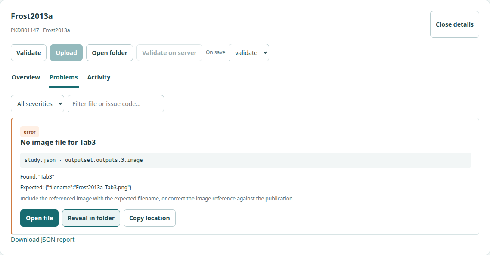

# Local curation app

!!! info "Available in the development version"

    The local curation command is implemented for [issue #826](https://github.com/matthiaskoenig/pkdb/issues/826) and is not yet part of a published release. Install the current checkout with `pip install ./python` to try it. The screenshots below show the running app and real offline validation of local apixaban studies, not design mockups.

The app brings study selection, validation feedback, and uploads into a local browser interface. You continue editing JSON, spreadsheets, images, and other source files in the default applications on your computer. PK-DB observes saved changes and automatically validates them, or validates and uploads them when you select **Upload on save**.

## Start with a local workspace

The launch command opens a browser window and watches an existing `pkdb_data` checkout:

```bash
pkdb curation /path/to/pkdb_data
```

You can also choose a substance directory or a single study folder. The app displays the selected workspace, server endpoint, authenticated PK-DB account, and vocabulary status. No local PK-DB server or Docker setup is required when uploading to a remote server.

## Select local studies

Workspace, file-watching, upload target, identity, and vocabulary controls are in the navigation header menus. The responsive workspace shows the study overview beside the selected study’s problems; on narrow screens these stack vertically. Selecting a study row, name, or checkbox opens its validation results immediately. Focus a row and press Enter or Space to open it with the keyboard. Use the detail panel to validate or validate and upload one study, or select several studies for batch actions.

The frontend has no GitHub user field. The command-line assignment options remain available for existing integrations.

## Open problems in your usual applications

Select a study to inspect its validation report. **Validate** checks locally with the selected vocabulary; **Validate on server** additionally requests validation from the configured server without saving the study. Filter problems by file, issue code, or severity. Reports include the available workbook, sheet, physical row/cell, or JSON path. Each problem explains what failed, what was found, and what correction to investigate.

Choose **Open file** to launch the computer's default application for that file type. **Reveal in folder** opens its containing directory; **Copy location** copies the diagnostic location for reference. The app does not edit or save source files. Opening a workbook does not guarantee that the spreadsheet application will jump to the reported cell.

[](images/curation/problems.png)

*Actual report: Frost2013a is missing a referenced image in the inspected checkout. Results depend on your source revision and vocabulary. The screenshot does not imply that the study was uploaded.*

The normal workflow is:

1. Choose a study and inspect its problems.
2. Open the affected file in its default application.
3. Edit and save outside the curation app.
4. Let PK-DB validate the saved changes and refresh the report.
5. Upload manually, or let **Upload on save** upload a valid snapshot.

## Choose what happens on save

The app watches source files and offers a save-action selector for each study or an explicitly selected group:

| Mode | Behavior |
| --- | --- |
| **Validate on save** | Default. Validate settled changes and refresh the problem list automatically. |
| **Upload on save** | Synchronize vocabulary, validate, and upload the valid snapshot to the displayed server. Validation errors block upload. |
| **Off** | Show that files changed; wait for a manual Validate or Upload action. |

Selecting **Upload on save** enables subsequent save-triggered uploads for the displayed studies, endpoint, and PK-DB account. It may replace existing studies where that account has permission. The app does not ask for confirmation on every save. The active mode and a pause control remain visible.

Multiple events from one save are combined. The app waits for saves to settle and handles temporarily locked workbooks before validation. Rapid edits keep the latest pending revision instead of uploading every intermediate change. Opening a file, changing a filter, or refreshing assignments does not upload anything.

If you save again during an upload, the in-flight upload refers to its original snapshot; the newest saved revision is processed afterwards. A connection failure with an uncertain save outcome pauses further uploads for that study until the outcome is checked. Restarting the app will not silently upload changes accumulated while it was stopped.

The activity list lets you cancel queued jobs and clear finished history. Active and unknown-outcome jobs remain visible. **Resume suspended work** attempts reconciliation first. If an upload still has an unknown outcome, **Review unknown outcome** shows the previous server target; an explicit acknowledgment is required before retrying that study. A retry may replace data already saved by the earlier request.

File watching continues while the local `pkdb curation` process runs, even if you close its browser tab. Stop the process to stop watching, or use the app's pause control to suspend automatic actions.

## Vocabulary, credentials, and offline work

Connected validation uses the target server's vocabulary. When its hash changes, the app retrieves and verifies the new snapshot and invalidates previous validation results. A processing-version mismatch requires upgrading the package; the app will not silently install software or change scientific values.

Uploads read Excel workbooks directly and send the original source files, including any existing TSV files. Uploading does not generate TSV exports from Excel sheets.

Uploads use your PK-DB API key and normal server permissions. Configure the endpoint and key as described in [Python client and API](python-client.md). GitHub access is separate from PK-DB authentication.

Offline work supports local browsing, cached assignments, file opening, and local validation. Its results are labeled as locally validated because server compatibility has not been checked. Upload-on-save is suspended offline.

## Practical setup

```bash
# Validate locally without any GitHub or PK-DB requests:
pkdb curation /path/to/pkdb_data/studies/apixaban --offline

# Connect to a server using the API key already set in your environment:
pkdb curation /path/to/pkdb_data --endpoint https://alpha.pk-db.com

# Select an assignment queue at launch:
pkdb curation /path/to/pkdb_data --github-user matthiaskoenig
```

Startup loads the endpoint from `PKDB_ENDPOINT` and the API key from `PKDB_API_KEY`. An explicit endpoint overrides the environment; a saved endpoint is the fallback when neither is provided. The key stays in service memory and is never returned to the browser. Open **Connection → Connection settings** to override the endpoint, enter an API key, or switch offline mode. Keys entered here stay in service memory; they are not saved in browser storage.

The app requires no Node installation, Docker, or hosted frontend. It binds to loopback and opens a protected launch URL in your default browser. With `--no-browser`, open the printed URL manually. Keep the local process running while you work; press **Ctrl+C** in its terminal to stop it. Use `--state-dir /path/to/app-state` for an isolated configuration and history directory outside your study workspace.

On-save actions initially use file polling with a quiet period. The app never edits study sources. Existing studies may be replaced by an authorized upload. The **Upload selected** review shows the target and identity, and labels unknown remote state rather than claiming that a study is new.

See the [technical design](superpowers/specs/2026-09-24-local-curation-interface-design.md) for job behavior and access boundaries. A connected server must support the current package API and API-key curation context. Offline validation does not establish server compatibility or upload permission.
