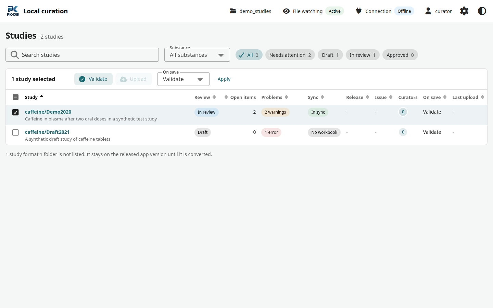
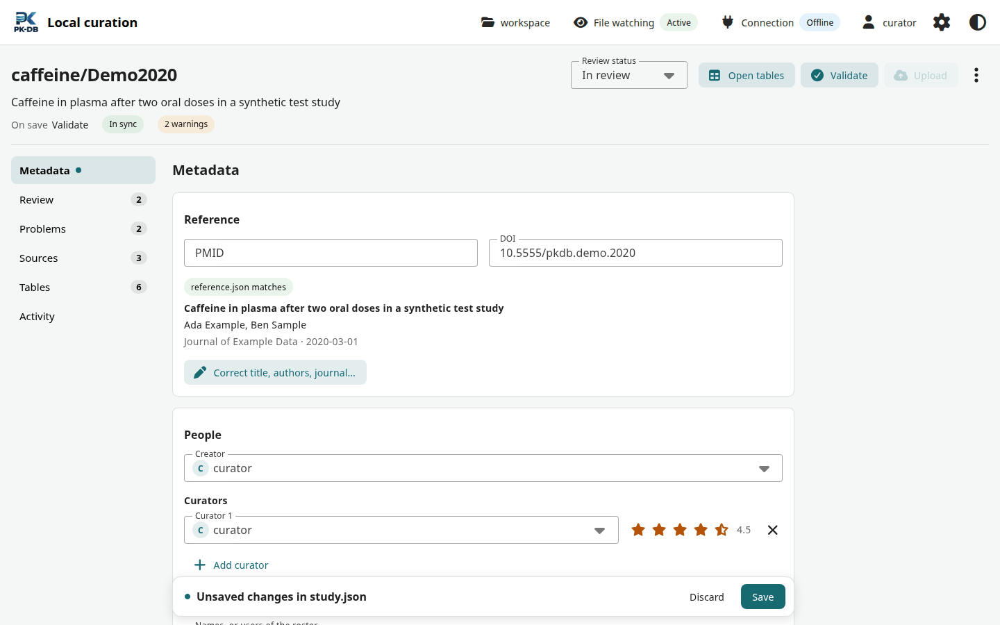
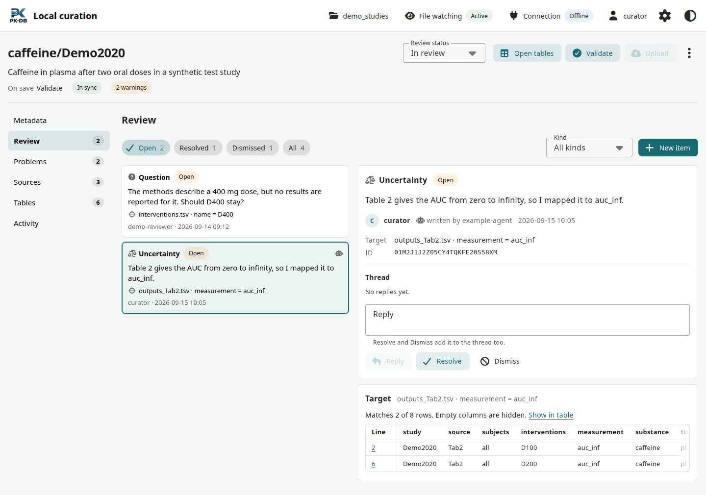
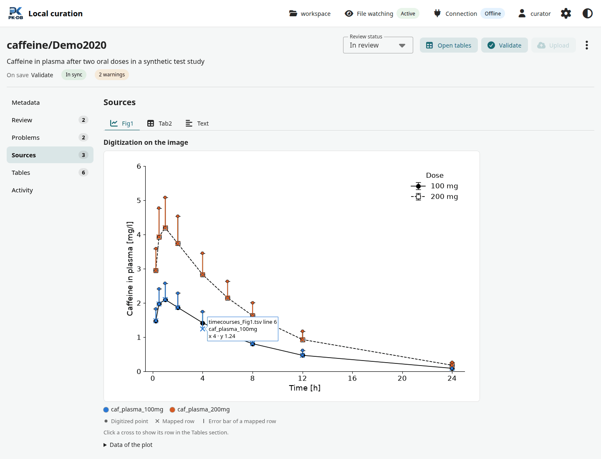
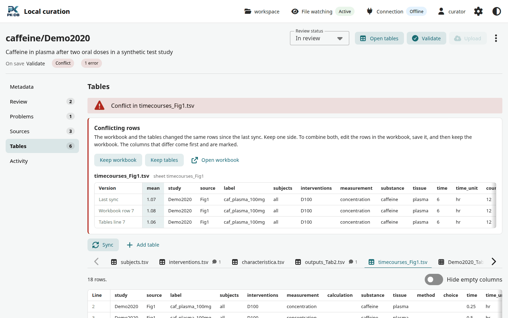

# Local curation app

!!! info "Available in the development version"

    `pkdb curate` is not yet part of a published release. To try it, build the app once in a source checkout and install the checkout: run `npm ci` and `npm run build:curation` in `frontend/` (Node **24.21.0** and npm **12.1.0**), then `pip install ./python`. See [Build from source](#build-from-source). The screenshots show the running app with the synthetic test studies of the repository, not design mockups.

`pkdb curate` opens a local app in your browser to check and curate study format 2 folders. You see a study in one place: its metadata, its review items, the validation problems at their cells, and each table and figure of the paper next to its raw extraction and the rows mapped into the database. You edit the metadata and the review items in the app and the tables in the study workbook. The app watches the folder, keeps the workbook and the tables in sync, and validates or uploads a study when you save a file.

AI agents work on the same files with the `pkdb` command line, which calls the same library functions as the app. The app checks a new `study.json` or `review.json` before it writes the file, writes it atomically, and refuses the write when the file changed on disk since the app read it.

## Start the app

```bash
pkdb curate /path/to/pkdb_data
```

The path is the workspace: a `pkdb_data` checkout, a substance folder or a single study folder. Without a path, the app opens the last workspace, else the nearest folder above the current folder that contains `studies/`, else the current folder.

`pkdb curate` prints a launch URL such as `PK-DB curation: http://127.0.0.1:43117/#token=...` and opens it in your default browser. The local server listens on `127.0.0.1` only. The token in the URL works once: it signs in the browser that opens it. With `--no-browser`, open the URL yourself. Keep the terminal open while you work, and press **Ctrl+C** there to stop the app.

| Option | Meaning |
| --- | --- |
| `--offline` | Send no network requests. Validation is local and uploads are off. |
| `--user USER` | Your PK-DB user name (default `PKDB_USER`). The app writes study files as this user. |
| `--endpoint URL` | The PK-DB server for checks and uploads (default `PKDB_ENDPOINT`). |
| `--port PORT` | The port of the local server (default: a free port). |
| `--no-browser` | Print the launch URL without opening it. |
| `--state-dir DIR` | Keep the settings and the activity in `DIR`, outside the workspace (default: `curation` in the PK-DB cache directory). |
| `--repository OWNER/NAME` | The GitHub repository of the study issues (default `matthiaskoenig/pkdb_data`). |

```bash
# Check studies locally, without any network request:
pkdb curate /path/to/pkdb_data/studies/caffeine --offline

# Connect to a server, as your PK-DB user, with your personal API key in PKDB_API_KEY:
export PKDB_ENDPOINT=https://beta.pk-db.com
export PKDB_USER=your-user-name
pkdb curate /path/to/pkdb_data
```

### User and API key

The app writes `study.json`, `review.json` and the tables as a PK-DB user, as `pkdb study` and `pkdb review` do. Set your user with `--user`, with `PKDB_USER`, or in **Settings**. The header shows the user. Without a user, the header says why writes are refused and offers **Set user**. A write that is refused for a missing user shows **Open settings** next to the message.

Uploads need your personal API key (see [Accounts and API keys](authentication.md)). Set `PKDB_API_KEY` before you start the app, or enter the key in **Settings**. The key stays in the memory of the local process: it is never saved and never sent to the browser. Once the server confirmed the key, the app writes as the account of the key. When the key belongs to another account than your user, writes are refused until you correct the user or the key.

**Settings**, the gear in the header, sets the PK-DB server, the PK-DB user, the personal API key and **Work offline**. The app saves the server and the user in its state directory for the next start, but not the key and not offline mode. At startup, `--endpoint` and `--user` come first, then `PKDB_ENDPOINT` and `PKDB_USER`, then the saved settings.

### The header

The header shows the workspace, **File watching**, **Connection**, the user, **Settings** and a button that switches between the light and the dark theme. The theme follows your system until you choose one. The app keeps your choice with its settings (see `--state-dir`), so it stays after `pkdb curate` starts again. Switching back to the theme of your system follows the system again.

The **Connection** badge shows the state of the PK-DB server. The app checks the server every 30 seconds, and the menu shows the upload target, the PK-DB account, the vocabulary and the versions of `pkdb` on both sides.

| Badge | Meaning |
| --- | --- |
| Connected | The server and its database answer. |
| Offline | Offline mode: the app sends no network requests. |
| Connecting | The app checks the server and its database. |
| Not configured | No PK-DB server is set. |
| Rejected API key | The server rejected the API key. |
| Update pkdb | The server needs a newer `pkdb`. Stop the app, run `pkdb update`, and start it again. |
| Error | The server check failed. The menu shows the error. |

To switch the workspace without a restart, open the workspace menu, the folder name in the header, and choose **Choose workspace**. The dialog browses the folders of your computer: select a folder to go into it, use **Up** or **Home**, or type a path and press **Go**. Folders with `studies/` are marked **Repository**, and folders with `study.json` are marked **Study**. **Open** beside a folder, or **Open this folder**, makes it the workspace. Hidden folders are not listed, and the dialog never shows the contents of files. The app remembers the last ten workspaces under **Recent workspaces**. A folder that no longer exists is marked **Unavailable**; its remove button takes it off the list.

## The overview

The overview lists the study format 2 folders of the workspace by their identity `<substance>/<name>`, with the title of the publication from `reference.json`.

[](images/curation/overview.png)

| Column | Shows |
| --- | --- |
| Study | The identity and the title. Two folders with the same identity are marked **Duplicate identity**. |
| Review | The status of `review.json` (Draft, In review or Approved), and **AI** for an automatic curation. |
| Open items | The number of open review items. |
| Problems | The errors and warnings of the last validation, or **valid**, and what the study is doing, such as **Validating**. |
| Sync | The sync status of the workbook and the tables, see [Tables](#tables). |
| Release | The PKDB identifier of the release in `study.json`. |
| Issue | The GitHub issue of the study, from `issue` in `study.json`. |
| Curators | The curators, with names and pictures from the curator roster that comes with `pkdb`, also offline. |
| On save | What a save does, see [What happens on save](#what-happens-on-save). |
| Last upload | The time of the last upload, with a link to the study on PK-DB. |

**Search studies** matches the identity and the title, and **Substance** shows one substance. The status chips **All**, **Needs attention**, **Draft**, **In review** and **Approved** count their studies. **Needs attention** lists the studies with errors, with a sync conflict, or with open items while they are in review. Click a column header to sort by it; every column except Curators sorts. Click a row to open the study.

Select studies with their checkboxes for the batch actions above the table. **Validate** queues a validation of each. **Upload** shows the server, the account and the studies, and then validates and uploads them. **On save** with **Apply** sets the On save action of the selected studies. Upload needs a connected server and the API key of an account that may upload studies; the disabled button says what is missing.

Study format 1 folders are not listed. The line below the table counts them, and the app never changes them. They stay on the released app version until they are converted.

## The study page

The header of a study shows its identity, its release, its issue and its provenance, the title of the publication, the PMID, the On save action, the sync status, the problems and the last upload. Its actions are the **Review status** select, **Open tables**, **Validate**, **Upload**, and the **More actions** menu with **Open folder**, **Open PDF** (`<name>.pdf` in the study folder), **Add table** and **Copy path**.

The rail on the left lists the sections Metadata, Review, Problems, Sources, Tables and Activity, with the number of open review items, problems, sources and tables. A study beyond the upload limits shows no number of sources and tables, because the app cannot read them; its Sources and Tables sections and the targets of its review items say so, and Problems names the limit. A study opens on Review when it has open items, on Problems when it has errors, and on Metadata otherwise.

### Metadata

The Metadata section edits `study.json` in forms.

[](images/curation/metadata.png)

- **Reference**: the PMID and the DOI, whether `reference.json` matches them, and the title, the authors and the journal of `reference.json`. **Correct title, authors, journal...** opens the Reference dialog.
- **People**: the creator, the curators with a rating from 0 to 5 stars in half steps, and the collaborators, offered from the curator roster.
- **Access and provenance**: the licence, open or closed, and the access, public or private; public needs a release. The provenance is a manual curation, or an automatic curation with its method, version, run ID and assets. A data import is shown as the importer set it.
- **Issue and release**: read only. They are set when the study is released; the `pkdb release` command for this is planned.
- **Descriptions and comments**, and **Notes per table** for each kind of table. A comment records the user who wrote it.

Edits stay in the form until you save them. The bar at the bottom shows **Unsaved changes in study.json** with **Save** and **Discard**, and **Undo** brings discarded edits back for a few seconds. Leaving the section with unsaved changes asks first. **Save** checks the whole document and writes it. When it is not valid, nothing is written and the fields with problems are marked. A new PMID or DOI fetches `reference.json` for it; when the lookup fails, `study.json` is saved and the bar says why.

When `study.json` changes on disk while the form has unsaved edits, **Save** is refused and the bar offers **Reload**. Reload puts your edits on top of the new version and marks the fields that changed on disk. A field that changed on both sides keeps your edit, shows the value on disk, and offers **Use the disk version**. Without unsaved edits, the form follows the file on disk by itself.

The Reference dialog writes `reference.json`. **Preview** shows the metadata and what changes, and **Save reference** writes the previewed version. For a study without a PMID or DOI, the dialog searches a citation and offers **Use DOI**, which puts the DOI into the form; save `study.json` to fetch its reference. See [Literature reference metadata](reference-metadata.md).

### Review

The Review section lists the items of `review.json`: questions, uncertainties and issues.

[](images/curation/review.png)

Filter the items by state (**Open**, **Resolved**, **Dismissed**, **All**) and by kind. A card shows the kind, the state, the target, the code of an acknowledged warning, a robot for an item of an AI agent, and the number of replies. Select a card to see the item with its thread. **Reply**, **Resolve**, **Dismiss** and **Reopen** change it. For an open item, Resolve and Dismiss also add the text of the reply field to the thread; for a resolved item, Dismiss and Reopen do. A dismissed item has no reply field and can only be reopened. **New item** adds an item about the whole study, a file, the rows with given column values, or a column.

Below the item, the target shows the rows that it matches, with **Show in table**. When the target is a series of a digitized figure, the `label` of `timecourses_<Fig>.tsv` or the `name` of `scatters_<Fig>.tsv`, the figure is drawn too, with that series emphasized and the other series faded.

The **Review status** select in the header sets Draft, In review or Approved. Approved needs zero open review items and zero validation errors. Otherwise the app refuses and says why, with a link to the open items or the problems. Approving records you as `approved_by`, adds you to the reviewers, and stores the time; any other status removes the approval. While a study is approved, items cannot be added or reopened: set the status to In review first.

### Problems

The Problems section lists the issues of the last validation by file. Each shows its severity, code and message, and where it is: the line and the column of the TSV file and the cell of the workbook sheet. Spelling suggestions follow **Did you mean:**.

Filter by **All**, **Errors** or **Warnings**. **Show in table** opens the Tables section at the cell of the issue. **Open** opens another file of the study, such as `study.json`, in its default application, and **Open tables** opens the workbook.

**Acknowledge** marks a warning as expected; errors cannot be acknowledged. It asks for a reason and writes a resolved review item that acknowledges exactly this warning: a warning at a row of a data table at its row and column, and a warning of a whole file by its key, such as the dataset of a WebPlotDigitizer project or the review item of `review.json`. Other warnings with the same code, also later ones, stay listed. The warning leaves the list after the next validation. The acknowledged warnings are listed below the problems with their reason and a link to their review item. An acknowledgement that names only a file, as the app wrote before acknowledgements were exact, covers every warning of its code in that file, also later ones, and the list says so. Dismissing the review item brings its warnings back.

### Sources

The Sources section has a tab for each source of the study: each paper table (`Tab…`), each figure (`Fig…`), and the text (`Text`).

[](images/curation/sources.png)

- A table shows its image, its raw extraction `<name>_<source>.tsv` as a grid with spreadsheet column letters, and the mapped rows.
- A figure with a WebPlotDigitizer project `<name>_<source>.wpd.json` shows the digitization on the image: dots for the digitized points, short bars for the digitized ends of error bars, crosses for the mapped rows and lines for their error bars. Hover a point to see its file, TSV line, series and values, and click a point, bar or cross to show its row in the Tables section. **Data of the plot** lists every point in a table. The series without a dataset in the project are plotted below the image.
- A figure without a project shows its image and a plot of the mapped rows.

The mapped rows of a source are the rows of its tables `outputs_<source>.tsv`, `timecourses_<source>.tsv` and `scatters_<source>.tsv`, and the rows of `subjects.tsv`, `interventions.tsv` and `characteristica.tsv` whose `source` names it. They are grouped by table, and each line number links to the row in the Tables section. A missing image or raw extraction shows the name of the file to add. The problems of the files of a source are listed at the end, by file, as in the Problems section.

### Tables

The Tables section starts with the sync status of the workbook `<name>.xlsx` and the tables.

[](images/curation/tables-conflict.png)

| Status | Meaning |
| --- | --- |
| In sync | The workbook and the tables agree. After a sync in the app, a line says what it changed. |
| Workbook open | The workbook is open in a spreadsheet program. Close it to sync. |
| Syncing | A sync runs. |
| Changed | The next sync changes files. |
| Conflict | The workbook and the tables changed the same rows. |
| No workbook | The study has no workbook yet. **Open tables** creates it. |
| Unknown | The workbook or the tables cannot be read. |
| Not checked yet | The app has not checked the workbook and the tables yet. |

When the workbook and the tables conflict, the panel **Conflicting rows** shows the rows of each conflicting table in one grid: the rows of the last sync, the rows of the workbook and the lines of the TSV file. The columns that differ come first and are marked. **Keep workbook** or **Keep tables** resolves all conflicts with one side. To combine both, edit the rows in the workbook, save it, and keep the workbook. **Open workbook** opens it. Validation and upload wait until the conflict is resolved.

Below the status are **Sync**, which syncs at once, and **Add table**, then a tab for each table and raw table. A tab counts the problems and the open review items of its table. The grid is read only. Its line numbers are the lines of the TSV file, the rows that open review items target are amber, and the cells with problems are outlined. **Hide empty columns** hides the columns without values.

### Activity

The Activity section lists the jobs of the study, newest first: validations, uploads, and the changes made in the app, such as `Saved study.json` or a sync of the workbook. An entry shows its status, such as **Succeeded**, **Problems found**, **Failed**, **Canceled**, **Conflict** or **Outcome unknown**, and **automatic** when the app started it by itself. **Cancel** cancels a queued job, **Download report** saves the validation report as a JSON file, **Open on PK-DB** opens an uploaded study, and **Review** opens an upload with an unknown outcome.

The app keeps the last 100 finished jobs of all workspaces. **Clear finished history** removes the finished jobs of the current workspace and deletes their reports, after you confirm it. It keeps the queued and running jobs, the uploads with an unknown outcome, the last upload of each study, which the overview shows as **Last upload**, and the current report of each study. The button is disabled when there is nothing to clear.

## What happens on save

The app scans the workspace every second. When the files of a study have not changed for a second, it queues a job for the study, unless On save is Off. Several file events of one save make one job, and quick saves in a row make one job for the newest version. Changes made in the app, such as **Save** in the Metadata section, count as saves.

A job:

1. creates `reference.json`, or replaces it, when it does not describe the PMID or DOI in `study.json`;
2. syncs the workbook and the tables as [`pkdb tables sync`](workbooks.md) does, and formats the tables. A conflict ends the job with the status **Conflict**, and nothing else runs. Tables or a workbook that cannot be read end the job with their problems;
3. validates the study;
4. uploads the study, when On save is Upload and the validation found no errors.

| On save | A save |
| --- | --- |
| Validate | Syncs, formats and validates the study. This is the default. |
| Upload | Syncs, formats and validates the study, and uploads it to the configured server when it has no errors. |
| Off | Marks the study as changed. Validate or upload it yourself. |

With a server and without offline mode, validation uses the vocabulary of the server. Offline, or without a server, it uses the cached vocabulary of the server, else the vocabulary that comes with `pkdb`. A local result does not show that the server accepts the study.

Turning on Upload asks you to review the server, the account and the studies first. After that, every save uploads the study without asking, and an upload can replace the study on the server. The app remembers the On save action of each study for the workspace, the server and the PK-DB account. Offline, or without an account that may upload, uploads on save wait and the study says so.

When the app starts or opens a workspace, it validates each study once, unless its On save is Off. It never uploads changes that were saved while it was not running. If you save again during an upload, the upload sends the version that it started with, and the newest version follows in the next job.

**File watching** in the header pauses and resumes the automatic actions. While they are paused, saved files wait and the queued jobs are canceled. Resume queues those jobs again with their own action, so a queued validation stays a validation; a study saved during the pause follows its On save action. File watching runs as long as `pkdb curate` runs, also when the browser tab is closed.

When the connection fails during an upload, the outcome of the upload is unknown. The same holds when you stop the app after an upload started sending the study, also while the server validates and saves it: after the next start, its Activity entry says **Interrupted by previous shutdown; inspect before retrying**. An upload that you stop before it sent anything is canceled. With an unknown outcome, the study shows **Upload outcome unknown** and does not upload again until you check it. A failed connection also pauses the automatic actions, and **Resume automatic actions** first asks the server whether it has the uploaded version. **Review**, in the overview or the Activity section, shows the server of the earlier upload. Once you checked the server, tick **I checked the server. Upload this study again.** and choose **Validate and upload again**. The new upload can replace what the earlier one saved.

## Work with the workbook

Tables are edited in the workbook `<name>.xlsx`, not in the app. **Open tables** syncs the study, creates the workbook when it does not exist, and opens it in the default application for `.xlsx` files. Save the workbook, and the app syncs it into the tables, formats them and validates the study. The app never replaces a workbook that is open; close it so that the app can update it from the tables. See [Edit tables in a workbook](workbooks.md).

**Add table**, in the study menu or the Tables section, adds an empty sheet to the workbook: a table of outputs, timecourses or scatters for a source such as `Tab3`, `Fig2A` or `Text`, or the raw table `<name>_<source>` of a paper table. Close the workbook first. The TSV file appears when the sheet has content and you save the workbook. Validation needs the image `<name>_<source>.png` of every paper table and figure.

When the workbook and the TSV files changed the same rows since the last sync, the sync stops and reports a conflict. Resolve it in the [Tables](#tables) section, or with `pkdb tables sync --keep workbook` or `--keep tables`.

## WebPlotDigitizer projects

Digitize a figure in WebPlotDigitizer 4 on the image `<name>_<source>.png` of the study, and import the project:

```bash
pkdb digitize import /path/to/studies/caffeine/Demo2020 Fig1 Demo2020_Fig1.tar
```

The command takes a project `.json` file or a saved `.tar` project, checks it against the image, and writes `<name>_<source>.wpd.json`. When the study has no image yet and the `.tar` project holds exactly one PNG image, it writes the image too. Name each dataset after its series: the `label` of a timecourse for its central values, `<label>;error_bar` for the ends of its error bars, and the `name` of a scatter for its points.

The Sources section then draws the digitized points and the mapped rows on the image. Validation warns about a dataset without rows (`unknown_dataset`). It also warns, as `digitized_mismatch`, about a mapped row more than 2 pixels away from every point of its dataset, and about the points of a dataset that have no mapped row within 2 pixels. `pkdb plot` draws the same comparison into PNG files, for agents. See [Raw extraction](study-format.md#raw-extraction) for the accepted projects.

## AI-curated studies

An AI agent curates a study with the same files and the `pkdb` command line. It edits `study.json` with `pkdb study`, writes the tables and the raw extractions, and adds review items with `pkdb review` for what it is not sure about. Review commands name the agent with `--agent` or `PKDB_AGENT`. The app shows the work of an agent:

- **AI** in the Review column of the overview and **AI curated** with the method in the study header, when the provenance in `study.json` is an automatic curation;
- a robot on the cards of the items of the agent, and **written by** with the name of the agent on the selected item;
- the raw extraction next to the mapped rows of each source in the Sources section.

Agents may add, answer, resolve and dismiss items, but a person approves a study: `pkdb review status approved` refuses to run for an agent, and the app always writes as a person. See the curation commands in [Python client](python-client.md#study-format-2-folders).

## Local API

This section is for developers. The front end talks to the local server through `/local/` routes. Every route except `POST /local/session`, which takes the launch token, needs the session cookie. Writes also need the CSRF header and a JSON body of at most 1 MiB. GET responses carry an `ETag` and answer `304` to `If-None-Match`, so the app polls cheaply.

- `GET /local/state`: the workspace, the connection, the author of writes, the study rows and the jobs.
- `GET /local/studies/{substance}/{name}`: the study page with metadata, review, problems, acknowledged warnings, sync status and conflicts, sources, files, the table files with their kinds in the order of the workbook sheets, the rows and the digitized series of each review target, a version of its files that changes with their content, and jobs. Below it, `.../tables/{file}`, `.../sources/{source}` and `.../files/{file}` (registered images only) serve one table, one source view and one image.
- `POST /local/studies/metadata`, `POST /local/studies/review` and `POST /local/studies/tables` write `study.json`, change `review.json` (add, reply, resolve, dismiss, reopen, status, acknowledge), and open, sync, resolve or add to the workbook.
- `POST /local/studies/tables/preview` and `POST /local/studies/review/preview` read without writing: what Add table would add for a kind and a source, with the sheet, the file, the image and why it would refuse, and which rows and digitized series a draft review target selects. The `add` action of `POST /local/studies/tables` takes the same `kind` and `source`.
- The other routes cover the session, the workspace and the folder browser, the settings, the On save action, the jobs, pause and resume, uploads with an unknown outcome, references, opening files, the history and the reports.

A stale revision answers `409` with the current document, and an invalid document answers `422` with its issues. A study beyond the upload limits answers `413` on the routes that read its tables and sources, and its study page lists the limit as the first problem, without tables, sources or review targets. A study that cannot be read answers `422` with its issues. Writes are refused with `403` and `no_user` without a user, or `user_mismatch` when the API key belongs to another account than the configured user. Every write of the app shows as a finished entry in the activity of the study. It starts no job of its own; the watcher validates the changed files as after any save. The [design](superpowers/specs/2026-10-06-curation-app-design.md) describes the app in more detail.

## Build from source

A published `pkdb` package contains the built app, so curators need no Node. A source checkout needs Node once, to build the app into `python/src/pkdb/curation/static/` (Node **24.21.0** and npm **12.1.0**):

```bash
cd frontend
npm ci
npm run build:curation
```

Build it again after you change the app or update the checkout. For development, `npm run dev:curation` serves the app with live reload at `http://localhost:8090` and forwards `/local` and `/avatars` to a running `pkdb curate`, whose address it reads from `PKDB_CURATION_URL`:

```bash
# Terminal 1, in the repository:
uv run --project python pkdb curate /path/to/workspace --no-browser --port 43117
# Terminal 2, in frontend/:
PKDB_CURATION_URL=http://127.0.0.1:43117 npm run dev:curation
```

Then open `http://localhost:8090/` followed by the `#token=...` part of the launch URL that `pkdb curate` printed. The browser tests of the app run against the real `pkdb curate`; see [Native frontend and frontend checks](installation.md#native-frontend-and-frontend-checks).

## Troubleshooting

| What you see | What to do |
| --- | --- |
| The local server stopped. Start pkdb curate again. | The `pkdb curate` process ended. Start it again and open the new launch URL. |
| This page has no session. Open the link that pkdb curate printed. | The page was opened without its launch URL, or the app was restarted on the same port. Open the launch URL that `pkdb curate` printed; pasting it into the open page works too. A launch URL works once: in the browser that opened it, reload the page instead. For another browser, restart `pkdb curate`. |
| The curation app is not built. Run npm ci and npm run build:curation in frontend/. | A source checkout without the built app. See [Build from source](#build-from-source). |
| Unable to start curation. Application state must be outside the selected source workspace | Choose a `--state-dir` outside the workspace. |
| The header offers **Set user**. | Set your PK-DB user in **Settings**, or start the app with `--user` or `PKDB_USER`. |
| **Upload** is disabled. | Hover it to see why: offline mode, no API key, no connected server, or an account that may not upload. |
| **Open tables**, **Open folder**, **Open PDF** or **Open** opens nothing, or the wrong program. | The app opens files with `xdg-open` on Linux, `open` on macOS and the file associations on Windows. To use another command, set `PKDB_OPEN_COMMAND` before you start the app, for example `PKDB_OPEN_COMMAND='gio open'`. The app splits it like a shell command and adds the absolute path of the file or folder as the last argument. The command must exit within 15 seconds, so use one that starts the program and returns. |
