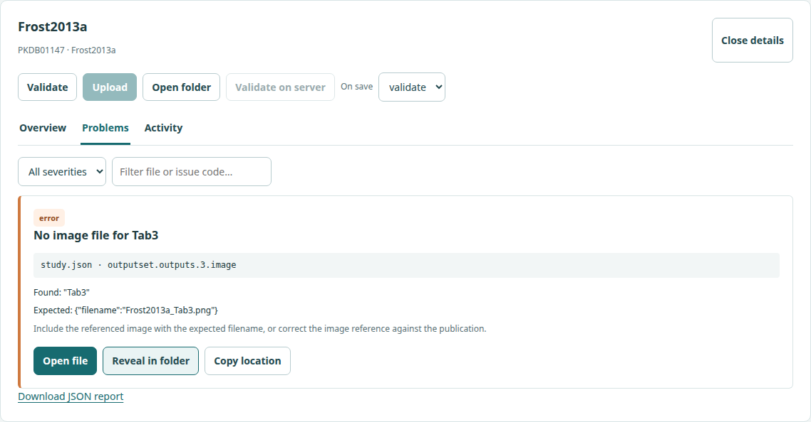

# Local curation app

!!! info "Available in the development version"

    The local curation command is implemented for [issue #826](https://github.com/matthiaskoenig/pkdb/issues/826) and is not yet part of a published release. To try it, build the app with `npm ci` and `npm run build:curation` in `frontend/` (Node **24.21.0** and npm **12.1.0**), then install the current checkout with `pip install ./python`. The screenshots below show the running app and real offline validation of local apixaban studies, not design mockups.

The app brings study selection, validation feedback, and uploads into a local browser interface. You continue editing JSON, spreadsheets, images, and other source files in the default applications on your computer. PK-DB observes saved changes and automatically validates them, or validates and uploads them when you select **Upload on save**.

## Start with a local workspace

The app lists study format 2 folders by `<substance>/<name>`. Format 1 folders are only counted and are never touched; format 1 curation stays on the released app version until the migration. The launch command opens a browser window and watches an existing `pkdb_data` checkout:

```bash
pkdb curate /path/to/pkdb_data
```

You can also choose a substance directory or a single study folder. The app displays the selected workspace, server endpoint, authenticated PK-DB account, and vocabulary status. No local PK-DB server or Docker setup is required when uploading to a remote server.

To switch workspace without restarting, open **Workspace › Choose workspace**. The dialog browses folders on your computer through the local service: select a folder to move into it, use **Up**, **Home**, or the path breadcrumb to move back, or paste a path and press **Go**. Folders containing `studies/` are marked **Repository** and folders containing `study.json` are marked **Study**. Choose **Open** beside a folder, or **Open this folder** for the folder shown, to start watching it. Hidden folders are not listed, and the dialog never shows file contents.

The app remembers the last ten opened workspaces in its state directory. Select one under **Recent workspaces** in the **Workspace** menu or the dialog to switch directly. Folders that no longer exist are marked **Unavailable**; remove entries with **×** in the **Workspace** menu. If the last workspace is missing when `pkdb curate` starts without a path, the app opens the nearest folder containing `studies/` above the current folder, or the current folder itself.

## Select local studies

Each study row shows its identity `<substance>/<name>`, the title of the publication from `reference.json`, the review status with the number of open review items, the error and warning counts of the last validation, the sync status of the workbook, the release, the GitHub issue, the curators, the **On save** action and the last upload. The GitHub issue of a study comes from the `issue` number in its `study.json`. Curator names and avatars come from the public curator roster bundled with the `pkdb` package, so they are shown offline; curators missing from the roster are shown by username.

Workspace, file-watching, upload target, identity, and vocabulary controls are in the navigation header menus. The responsive workspace shows the study overview beside the selected study’s problems; on narrow screens these stack vertically. Selecting a study row, name, or checkbox opens its validation results immediately. Focus a row and press Enter or Space to open it with the keyboard. Use the detail panel to validate or validate and upload one study, or select several studies for batch actions.

The frontend has no GitHub user field. The command-line assignment options remain available for existing integrations.

## Open problems in your usual applications

Select a study to inspect its validation report. **Validate** checks locally with the selected vocabulary; **Validate on server** additionally requests validation from the configured server without saving the study. Filter problems by file, issue code, or severity. Reports include the available workbook, sheet, physical row/cell, or JSON path. Each problem explains what failed, what was found, and what correction to investigate.

Choose **Open file** to launch the computer's default application for that file type. **Reveal in folder** opens its containing directory; **Copy location** copies the diagnostic location for reference. Opening a workbook does not guarantee that the spreadsheet application will jump to the reported cell.

[](images/curation/problems.png)

*Actual report: Frost2013a is missing a referenced image in the inspected checkout. Results depend on your source revision and vocabulary. The screenshot does not imply that the study was uploaded.*

The normal workflow is:

1. Choose a study and inspect its problems.
2. Open the affected file in its default application.
3. Edit and save outside the curation app.
4. Let PK-DB validate the saved changes and refresh the report.
5. Upload manually, or let **Upload on save** upload a valid snapshot.

## Choose what happens on save

The app watches source files and offers a save-action selector for each study or an explicitly selected group:

| Mode | Behavior |
| --- | --- |
| **Validate on save** | Default. Validate settled changes and refresh the problem list automatically. |
| **Upload on save** | Synchronize vocabulary, validate, and upload the valid snapshot to the displayed server. Validation errors block upload. |
| **Off** | Show that files changed; wait for a manual Validate or Upload action. |

Selecting **Upload on save** enables subsequent save-triggered uploads for the displayed studies, endpoint, and PK-DB account. It may replace existing studies where that account has permission. The app does not ask for confirmation on every save. The active mode and a pause control remain visible.

Each save first synchronizes the study workbook with its tables as [`pkdb tables sync`](workbooks.md) does, then formats and validates the study, and uploads it when the mode is **Upload on save**. A sync conflict stops the job until you resolve it with `pkdb tables sync --keep workbook` or `pkdb tables sync --keep tables`, or in the workbook; the conflicting rows are listed as problems of the study. Tables that cannot be read, such as a table with an unknown column, or a workbook that cannot be read stop the job as well and are reported as validation problems. Multiple events from one save are combined. The app waits for saves to settle and handles temporarily locked workbooks before validation. Rapid edits keep the latest pending revision instead of uploading every intermediate change. Opening a file, changing a filter, or refreshing assignments does not upload anything.

If you save again during an upload, the in-flight upload refers to its original snapshot; the newest saved revision is processed afterwards. A connection failure with an uncertain save outcome pauses further uploads for that study until the outcome is checked. Restarting the app will not silently upload changes accumulated while it was stopped.

After a successful upload, the study overview, the detail panel, and the activity entry link to the uploaded study on the PK-DB website. The link remains available after restarting the app. The activity list lets you cancel queued jobs and clear finished history. Active and unknown-outcome jobs remain visible. **Resume suspended work** attempts reconciliation first. If an upload still has an unknown outcome, **Review unknown outcome** shows the previous server target; an explicit acknowledgment is required before retrying that study. A retry may replace data already saved by the earlier request.

File watching continues while the local `pkdb curate` process runs, even if you close its browser tab. Stop the process to stop watching, or use the app's pause control to suspend automatic actions. Pausing cancels the queued jobs, and resuming queues each of them again with its original action, so a queued validation stays a validation also when the study uploads on save; a save while paused follows the **On save** action instead.

## Vocabulary, credentials, and offline work

Connected validation uses the target server's vocabulary. When its hash changes, the app retrieves and verifies the new snapshot and invalidates previous validation results. A processing-version mismatch requires upgrading the package; the app will not silently install software or change scientific values.

Uploads use your PK-DB API key and normal server permissions. Configure the endpoint and key as described in [Python client and API](python-client.md). GitHub access is separate from PK-DB authentication.

Offline work supports local browsing, cached assignments, file opening, and local validation. Its results are labeled as locally validated because server compatibility has not been checked. Upload-on-save is suspended offline.

## Practical setup

```bash
# Validate locally without any GitHub or PK-DB requests:
pkdb curate /path/to/pkdb_data/studies/apixaban --offline

# Connect to the server and API key already set in your environment:
export PKDB_ENDPOINT=https://beta.pk-db.com
pkdb curate /path/to/pkdb_data

# Select an assignment queue at launch:
pkdb curate /path/to/pkdb_data --github-user matthiaskoenig
```

Startup loads the endpoint from `PKDB_ENDPOINT`, the expected PK-DB username from `PKDB_USER`, and the API key from `PKDB_API_KEY`. Explicit `--endpoint` and `--user` options override the environment; saved settings are the fallback when neither is provided. The key stays in service memory and is never returned to the browser. Open **Connection → Connection settings** to override the endpoint or username, enter an API key, or switch offline mode. Keys entered here stay in service memory; they are not saved in browser storage.

The **Connection** badge in the header always shows whether the PK-DB server and its database are reachable. The service checks the server every 30 seconds while it runs:

| Badge | Meaning |
| --- | --- |
| Connected | Server and database answered; the vocabulary and API-key account were verified |
| Checking… | The first check after startup or a settings change is running |
| Not connected | The server cannot be reached or reports that it or its database is unavailable |
| Not signed in | The server is reachable but rejected the API key, or the key belongs to a different account than the expected username |
| Update required | The server's processing rules differ from this `pkdb` release; run `pkdb update` |
| Offline / Not configured | Offline mode is on, or no server address is set |
| Service stopped | The local `pkdb curate` process no longer responds |

The menu explains the last failure, when the server was last checked, and the client and server versions. It recommends `pkdb update` when the server runs a newer release.

The app requires no Node installation, Docker, or hosted frontend. It binds to loopback and opens a protected launch URL in your default browser. With `--no-browser`, open the printed URL manually. Keep the local process running while you work; press **Ctrl+C** in its terminal to stop it. Use `--state-dir /path/to/app-state` for an isolated configuration and history directory outside your study workspace.

On-save actions use file polling with a quiet period. Existing studies may be replaced by an authorized upload. The **Upload selected** review shows the target and identity, and labels unknown remote state rather than claiming that a study is new.

See the [technical design](superpowers/specs/2026-09-24-local-curation-interface-design.md) for job behavior and access boundaries. A connected server must support the current package API and API-key curation context. Offline validation does not establish server compatibility or upload permission.

## Local API

The front end talks to the local service through `/local/` routes. All of them require the session cookie, and writes also require the CSRF header and JSON bodies of at most 1 MiB. GET responses carry an `ETag` and answer `304` to `If-None-Match`. The study routes are `GET /local/state`, `GET /local/studies/{substance}/{name}`, `.../tables/{file}`, `.../sources/{source}` and `.../files/{file}` (registered images only). The study page lists the creator, curators and collaborators with their roster profiles under `people`, the summary of `reference.json` under `reference` with `reference_match` (whether it has the PubMed ID and DOI of `study.json`), and the message and last upload of the row; `GET /local/curators` returns the bundled curator roster with names and avatar URLs. Writes go through `POST /local/studies/metadata` (`study.json`), `POST /local/studies/review` (`review.json` actions) and `POST /local/studies/tables` (open, sync, resolve, add a sheet); the workbook actions refuse a workbook that is a symlink. A stale revision returns `409` with the current document, validation errors return `422` with the issues, and writes are refused with `403`: `no_user` when no user is known and `user_mismatch` when the API key belongs to another account than the configured user. Writes are made as the account of the API key once the server confirmed it, otherwise as the configured user, as with `pkdb study` and `pkdb review`; `GET /local/state` names that author in `author.user`, or the reason why writes are refused in `author.reason`. Every write of the app is listed as a finished `write` entry in the activity of the study, such as "Saved study.json"; it starts no job, and the watcher validates the changed files as after any save. The session, workspace, settings, jobs, reference and file-open routes are unchanged.

## Literature references

Choose **Reference…** in the study detail panel to retrieve metadata from a PMID or DOI, search a manual citation, preview changes, and save `reference.json`. Source edits made since preview prevent saving an outdated result. See the [reference metadata guide](reference-metadata.md) for caching, manual references, publication-date precision, and refresh behavior.
