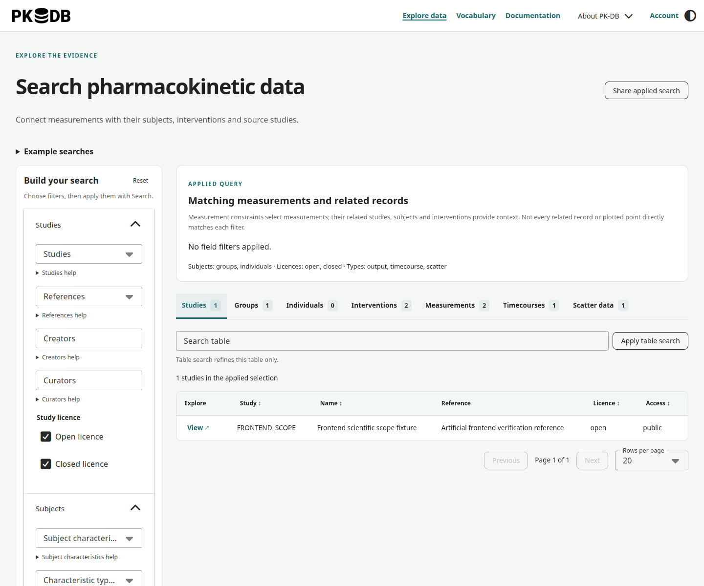
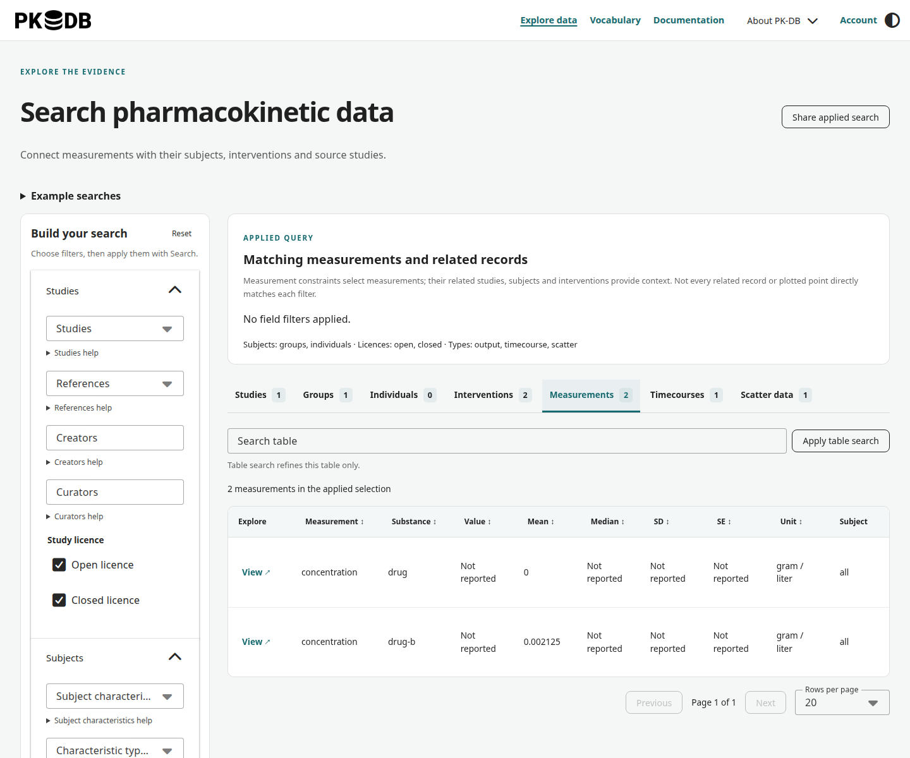
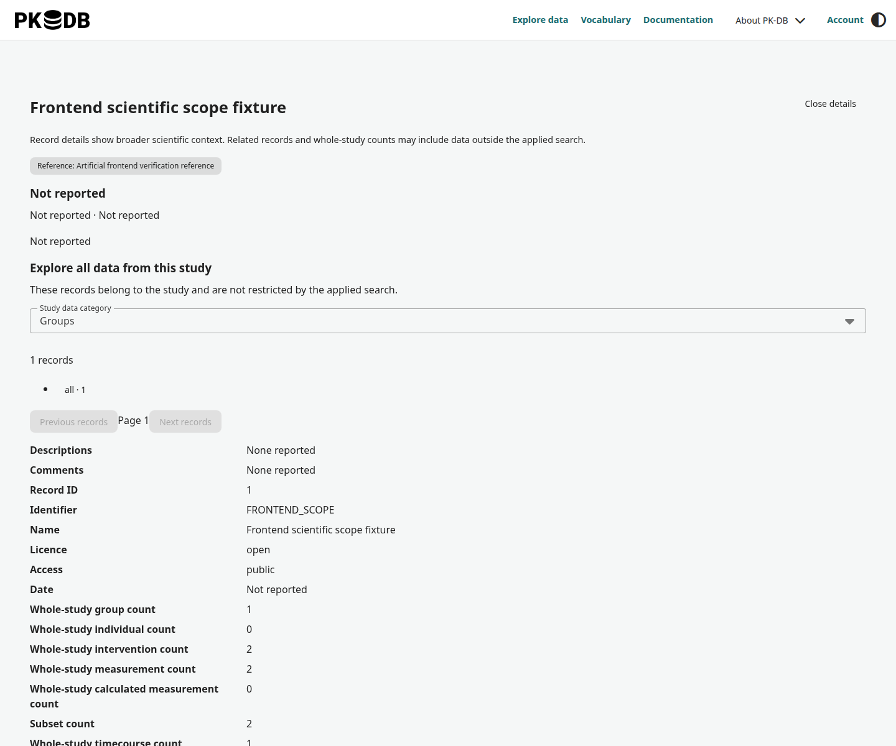
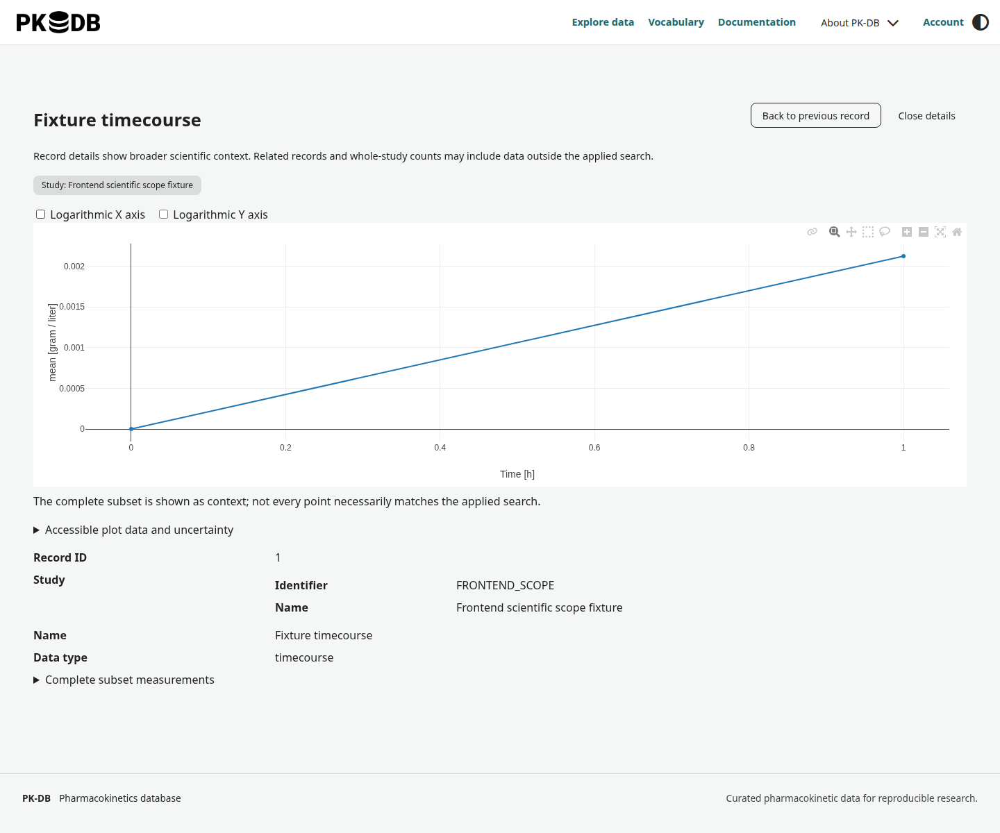

# Webinterface

Open [alpha.pk-db.com](https://alpha.pk-db.com) to explore PK-DB in your browser. No installation is needed. Public study browsing is available without an account; downloads and access to shared private studies require [sign-in](authentication.md).

The screenshots below show the current frontend with artificial demonstration data. Study names, counts, and values illustrate the interface, not scientific results from the public collection. Select a screenshot to view it at full size.

For a scientific example of how a publication is represented in PK-DB, see the [example study](example-study.md).

## Explore database coverage

The landing page shows current totals and interactive charts for studies, substances with timecourses, and PK parameter values. Choose a year range, switch studies and substances between annual and cumulative counts, or select a PK parameter to compare reported and calculated values. The substance chart ranks current timecourse coverage.

Hover for values, drag to zoom, and double-click to reset. Each chart includes a data table and a PNG download. Counts reflect studies you can access and refresh when your session changes. Years use the study date; undated studies appear in current totals and a separate notice. Cumulative substance counts include each substance only once. These charts describe the current collection by study date, not earlier database snapshots.

## Find studies

Open **Explore data** to reach **Search pharmacokinetic data**. The research filters appear on the left on a desktop; on a smaller screen, open **Filters and Search**.

1. Choose the substances, measurement types, subject characteristics, or study criteria relevant to your question.
2. Select the subject types, licences, and measurement types you want to include.
3. Choose **Search** to apply the filters. Editing a filter changes the draft; it does not change the results until you search.
4. Review the applied selection and the counts beside each result category.

The example searches load a draft you can inspect and adjust before choosing **Search**. If no results match, broaden the filters and search again.

### Choose the scope of your search

**Matching measurements and related records** selects measurements matching the constraints and returns their associated study, subject, and intervention context. Related records may contain information beyond the individual match.

**All data from qualifying studies** returns the broader study context. Different records within one study can satisfy different conditions, so not every returned measurement necessarily matches every filter.

Use **Share applied search** to copy the current search link. The link preserves criteria; it does not freeze the data or grant another person access to private studies.

## Browse measurements and related records

Switch between **Studies**, **Groups**, **Individuals**, **Interventions**, **Measurements**, **Timecourses**, and **Scatter data** to explore the same applied selection from different perspectives.

Read the measurement type, substance, value or summary statistic, and unit together. Open a record to inspect its subject and intervention context before comparing values across studies.

**Search table** refines only the current table; choose **Apply table search** to apply it. It does not replace the research filters. Use column sorting and **Previous** / **Next** to navigate longer result sets.

## Open a study

Select a study in the results to view its publication, metadata, and associated data. Under **Explore all data from this study**, choose a **Study data category** to browse its groups, individuals, interventions, measurements, or series.

Related-record buttons let you follow links between a measurement, its subject, and its intervention. **Back to previous record** retraces that exploration; **Close details** returns to the search. Study details can include records outside your applied search because they show the study's broader context.

## Explore timecourses and scatter data

Open a timecourse record and choose **Show timecourse plot**, or open a scatter record and choose **Show scatter plot**. Inspect axis labels and units, and use **Accessible plot data and uncertainty** to read the values as a table.

A plot shows the complete subset as context, including points that may not individually match your search. A logarithmic axis cannot display zero or negative values; check the accompanying table when these are relevant.

## Sign in and download

Open **Account** to sign in with your username and password. If you need an account or an API key, follow [Accounts and API keys](authentication.md).

Study attachments are listed in the study details when available to your account. Sign in before opening or downloading them. For a reproducible dataset download with explicit filters, use the [Python client](python-client.md#download-data) or [REST API](api.md#download-a-dataset).

Review the study licence and cite the underlying publication and [PK-DB](index.md#how-to-cite) when using the data.
